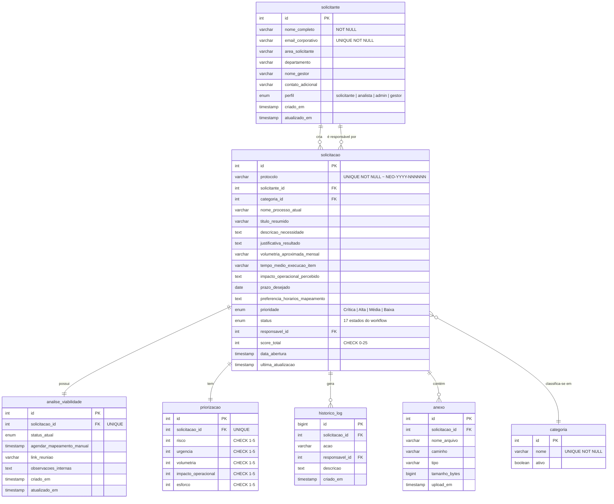

# 📊 Modelo de Dados — Sistema NEO

## Visão Geral

O **Sistema NEO** é uma plataforma de gestão de solicitações (tirador de pedidos) que permite o registro, triagem, análise e acompanhamento de demandas internas. Este repositório contém a modelagem completa do banco de dados **PostgreSQL 15+**.

---

## 📌 Documentação

Este documento (`README.md`) é autocontido e descreve toda a modelagem de dados do Sistema NEO, incluindo o diagrama Entidade-Relacionamento, a descrição de todas as tabelas, enums, triggers e instruções de instalação.

---

## 📐 Diagrama Entidade-Relacionamento



---

## 📋 Descrição das Tabelas

### 1. `solicitante`
Armazena os usuários do sistema com seus perfis de acesso.

| Coluna | Tipo | Restrição | Descrição |
|--------|------|-----------|-----------|
| `id` | SERIAL | PK | Identificador único |
| `nome_completo` | VARCHAR(255) | NOT NULL | Nome completo do usuário |
| `email_corporativo` | VARCHAR(255) | UNIQUE, NOT NULL | E-mail corporativo (login) |
| `area_solicitante` | VARCHAR(100) | | Área de atuação |
| `departamento` | VARCHAR(100) | | Departamento |
| `nome_gestor` | VARCHAR(255) | | Nome do gestor imediato |
| `contato_adicional` | VARCHAR(255) | | Telefone ou outro contato |
| `perfil` | ENUM | NOT NULL, DEFAULT 'solicitante' | Nível de acesso |
| `criado_em` | TIMESTAMP | NOT NULL, DEFAULT NOW() | Data de criação |
| `atualizado_em` | TIMESTAMP | NOT NULL, DEFAULT NOW() | Última atualização (trigger) |

### 2. `categoria`
Catálogo de categorias para classificar as solicitações.

| Coluna | Tipo | Restrição | Descrição |
|--------|------|-----------|-----------|
| `id` | SERIAL | PK | Identificador único |
| `nome` | VARCHAR(100) | UNIQUE, NOT NULL | Nome da categoria |
| `ativo` | BOOLEAN | NOT NULL, DEFAULT TRUE | Se a categoria está ativa |

### 3. `solicitacao`
**Entidade principal** — cada registro representa uma solicitação no sistema.

| Coluna | Tipo | Restrição | Descrição |
|--------|------|-----------|-----------|
| `id` | SERIAL | PK | Identificador único |
| `protocolo` | VARCHAR(20) | UNIQUE, NOT NULL | Formato: `NEO-YYYY-NNNNNN` (auto-gerado) |
| `solicitante_id` | INTEGER | FK → solicitante | Quem criou a solicitação |
| `categoria_id` | INTEGER | FK → categoria | Classificação da solicitação |
| `nome_processo_atual` | VARCHAR(255) | | Nome do processo atual |
| `titulo_resumido` | VARCHAR(255) | | Título curto da necessidade |
| `descricao_necessidade` | TEXT | | Descrição detalhada |
| `justificativa_resultado` | TEXT | | Justificativa do resultado esperado |
| `volumetria_aproximada_mensal` | VARCHAR(100) | | Volume estimado |
| `tempo_medio_execucao_item` | VARCHAR(100) | | Tempo médio por item |
| `impacto_operacional_percebido` | TEXT | | Impacto na operação |
| `prazo_desejado` | DATE | | Data limite desejada |
| `preferencia_horarios_mapeamento` | TEXT | | Horários preferenciais |
| `prioridade` | ENUM | | Crítica, Alta, Média, Baixa |
| `status` | ENUM | NOT NULL, DEFAULT 'Aguardando triagem' | Estado atual no workflow |
| `responsavel_id` | INTEGER | FK → solicitante | Analista responsável |
| `score_total` | INTEGER | CHECK (0-25) | Soma dos fatores de priorização |
| `data_abertura` | TIMESTAMP | NOT NULL, DEFAULT NOW() | Data de abertura |
| `ultima_atualizacao` | TIMESTAMP | NOT NULL, DEFAULT NOW() | Última atualização (trigger) |

### 4. `analise_viabilidade`
Análise de viabilidade atrelada a cada solicitação (relação 1:1).

| Coluna | Tipo | Restrição | Descrição |
|--------|------|-----------|-----------|
| `id` | SERIAL | PK | Identificador único |
| `solicitacao_id` | INTEGER | FK UNIQUE → solicitacao | Solicitação analisada |
| `status_atual` | ENUM | | Status após análise |
| `agendar_mapeamento_manual` | TIMESTAMP | | Data/hora do mapeamento |
| `link_reuniao` | VARCHAR(500) | | Link da reunião |
| `observacoes_internas` | TEXT | | Notas internas |
| `criado_em` | TIMESTAMP | NOT NULL, DEFAULT NOW() | Data de criação |
| `atualizado_em` | TIMESTAMP | NOT NULL, DEFAULT NOW() | Última atualização (trigger) |

### 5. `priorizacao`
Pontuação de priorização da solicitação (relação 1:1).

| Coluna | Tipo | Restrição | Descrição |
|--------|------|-----------|-----------|
| `id` | SERIAL | PK | Identificador único |
| `solicitacao_id` | INTEGER | FK UNIQUE → solicitacao | Solicitação priorizada |
| `risco` | INTEGER | CHECK (1-5) | Nível de risco |
| `urgencia` | INTEGER | CHECK (1-5) | Nível de urgência |
| `volumetria` | INTEGER | CHECK (1-5) | Volume de trabalho |
| `impacto_operacional` | INTEGER | CHECK (1-5) | Impacto na operação |
| `esforco` | INTEGER | CHECK (1-5) | Esforço necessário |

### 6. `historico_log`
Registro de auditoria de todas as ações sobre as solicitações.

| Coluna | Tipo | Restrição | Descrição |
|--------|------|-----------|-----------|
| `id` | BIGSERIAL | PK | Identificador único |
| `solicitacao_id` | INTEGER | FK → solicitacao | Solicitação afetada |
| `acao` | VARCHAR(255) | NOT NULL | Tipo de ação realizada |
| `responsavel_id` | INTEGER | FK → solicitante | Quem realizou a ação |
| `descricao` | TEXT | | Detalhes da ação |
| `criado_em` | TIMESTAMP | NOT NULL, DEFAULT NOW() | Data/hora da ação |

### 7. `anexo`
Documentos anexados às solicitações.

| Coluna | Tipo | Restrição | Descrição |
|--------|------|-----------|-----------|
| `id` | SERIAL | PK | Identificador único |
| `solicitacao_id` | INTEGER | FK → solicitacao | Solicitação do anexo |
| `nome_arquivo` | VARCHAR(255) | NOT NULL | Nome original do arquivo |
| `caminho` | VARCHAR(500) | NOT NULL | Caminho de armazenamento |
| `tipo` | VARCHAR(100) | | Tipo MIME do arquivo |
| `tamanho_bytes` | BIGINT | | Tamanho em bytes |
| `upload_em` | TIMESTAMP | NOT NULL, DEFAULT NOW() | Data do upload |

---

## 🏷️ Enums (Domínios)

### `perfil_usuario`
| Valor | Descrição |
|-------|-----------|
| `solicitante` | Usuário comum que abre solicitações |
| `analista` | Responsável por analisar e direcionar |
| `admin` | Administrador do sistema |
| `gestor` | Líder de equipe com permissões elevadas |

### `prioridade_solicitacao`
| Valor | Descrição |
|-------|-----------|
| `Crítica` | Requer atenção imediata |
| `Alta` | Alta prioridade |
| `Média` | Prioridade intermediária |
| `Baixa` | Baixa prioridade |

### `status_solicitacao` (17 estados do workflow)
| Status | Descrição |
|--------|-----------|
| `Aguardando triagem` | Estado inicial |
| `Em triagem` | Sendo triado |
| `Pendente de informações` | Aguardando dados complementares |
| `Aguardando mapeamento` | Aguardando análise |
| `Mapeamento agendado` | Mapeamento com data marcada |
| `Em mapeamento` | Análise em andamento |
| `Em análise de viabilidade` | Avaliando viabilidade |
| `Elegível` | Aprovado para prosseguir |
| `Não elegível` | Reprovado |
| `Fora do escopo` | Não se enquadra |
| `Priorizado` | Definida ordem de ataque |
| `Backlog` | Na fila de espera |
| `Direcionado para outra área` | Redirecionado |
| `Em desenvolvimento` | Sendio desenvolvido |
| `Em homologação` | Em fase de testes |
| `Concluído` | Finalizado com sucesso |
| `Cancelado` | Cancelado |

---

## ⚙️ Triggers e Funções

### Trigger: Atualizar Timestamp
```sql
-- Atualiza automaticamente o campo 'atualizado_em' nas tabelas:
-- solicitante, solicitacao, analise_viabilidade
CREATE TRIGGER trg_solicitante_atualizado
  BEFORE UPDATE ON solicitante
  FOR EACH ROW EXECUTE FUNCTION fn_atualizar_timestamp();
```

### Trigger: Gerar Protocolo
```sql
-- Gera automaticamente o protocolo no formato NEO-YYYY-NNNNNN
-- Exemplo: NEO-2026-000001
CREATE TRIGGER trg_solicitacao_protocolo
  BEFORE INSERT ON solicitacao
  FOR EACH ROW EXECUTE FUNCTION fn_gerar_protocolo();
```

---

## 🚀 Instalação

### Pré-requisitos
- PostgreSQL 15 ou superior
- Acesso ao psql ou outro cliente SQL

### Passo a passo

```bash
# 1. Criar o banco de dados
psql -c 'CREATE DATABASE "Sistema NEO";'

# 2. Conectar ao banco
psql -d "Sistema NEO"

# 3. Executar o script DDL (ddl.sql) para criar enums, tabelas, triggers e funções
\i caminho/para/ddl.sql
```

Ou via linha de comando:
```bash
psql -d "Sistema NEO" -f caminho/para/ddl.sql
```

---

## 🔗 Cardinalidades

| Relação | Origem | Destino | Cardinalidade | Descrição |
|---------|--------|---------|---------------|-----------|
| Cria | solicitante | solicitacao | 1:N | Um solicitante pode criar várias solicitações |
| Responsável | solicitante | solicitacao | 1:N | Um analista pode ser responsável por N solicitações |
| Análise | solicitacao | analise_viabilidade | 1:1 | Cada solicitação tem no máximo uma análise |
| Priorização | solicitacao | priorizacao | 1:1 | Cada solicitação tem um único cálculo de priorização |
| Log | solicitacao | historico_log | 1:N | Cada solicitação gera N registros de auditoria |
| Anexos | solicitacao | anexo | 1:N | Cada solicitação pode ter N anexos |
| Categoria | solicitacao | categoria | N:1 | Cada solicitação pertence a uma categoria |

---

## 📏 Convenções Adotadas

| Elemento | Padrão |
|----------|--------|
| **Chaves primárias** | `id SERIAL` em todas as tabelas |
| **Chaves estrangeiras** | `{tabela}_id` (nome da tabela referenciada + `_id`) |
| **Índices** | Criados para todas as FKs e campos de busca frequente |
| **Enums PostgreSQL** | Garantem integridade dos valores de perfil, prioridade e status |
| **Protocolo** | Formato `NEO-YYYY-NNNNNN`, gerado automaticamente via trigger |
| **Timestamps** | `criado_em` na inserção, `atualizado_em` via trigger |

---

## 📄 Licença

Este projeto faz parte do Sistema NEO — Documentação interna para fins de desenvolvimento.