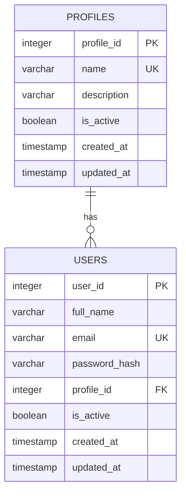

# Persistência para Autenticação

## Issue relacionada

Issue #10 — BANCO DE DADOS - Preparar persistência para autenticação

## Objetivo

Documentar a estrutura de banco de dados preparada para suportar a autenticação da aplicação, incluindo as tabelas `profiles` e `users`, seus relacionamentos, restrições, regras de integridade e decisões de modelagem.

Esta implementação prepara a camada de persistência necessária para que o Backend possa realizar posteriormente o fluxo de autenticação.

A responsabilidade desta implementação está limitada à persistência dos dados necessários para autenticação. A lógica de autenticação, geração de tokens, validação de credenciais e demais regras de aplicação permanecem sob responsabilidade do Backend.

## Visão geral do modelo

A persistência de autenticação é composta inicialmente por duas tabelas:

- `profiles`: armazena os perfis disponíveis para classificação dos usuários;
- `users`: armazena os usuários que poderão utilizar o mecanismo de autenticação.

O relacionamento entre as tabelas é do tipo **1:N (um para muitos)**:

- um registro em `profiles` pode estar associado a vários registros em `users`;
- cada registro em `users` deve estar associado a exatamente um registro em `profiles`.

A associação é realizada por meio da chave estrangeira `users.profile_id`, que referencia `profiles.profile_id`.

### Diagrama de relacionamento



Onde:

- `PK` = Primary Key;
- `FK` = Foreign Key;
- `UK` = Unique Key.

O relacionamento pode ser representado de forma simplificada como:

```text
profiles
   1
   │
   │
   N
 users
```

Ou seja, um perfil pode estar associado a vários usuários, enquanto cada usuário deve estar associado a um único perfil.

## Tabela `profiles`

A tabela `profiles` armazena os perfis que podem ser associados aos usuários da aplicação.

Cada usuário deve possuir um perfil, e um mesmo perfil pode ser utilizado por vários usuários.

### Estrutura

| Campo         | Tipo         | Obrigatório | Restrição / Default         | Finalidade                                   |
| ------------- | ------------ | ----------- | --------------------------- | -------------------------------------------- |
| `profile_id`  | INTEGER      | Sim         | Primary Key, auto increment | Identificador único do perfil                |
| `name`        | VARCHAR(60)  | Sim         | UNIQUE, NOT NULL            | Nome do perfil                               |
| `description` | VARCHAR(255) | Não         | NULL permitido              | Descrição opcional do perfil                 |
| `is_active`   | BOOLEAN      | Sim         | DEFAULT TRUE                | Indica se o perfil está ativo                |
| `created_at`  | TIMESTAMP    | Sim         | DEFAULT CURRENT_TIMESTAMP   | Data e hora de criação do registro           |
| `updated_at`  | TIMESTAMP    | Sim         | DEFAULT CURRENT_TIMESTAMP   | Data e hora da última atualização registrada |

### Restrições

- `profile_id` é a chave primária da tabela;
- `name` deve possuir valor único;
- `name` não pode ser nulo;
- `is_active` não pode ser nulo e possui valor padrão `TRUE`;
- `created_at` e `updated_at` são preenchidos inicialmente com a data e hora da criação do registro.

### Regra de atualização

O valor de `updated_at` recebe a data e hora atual na criação do registro.

A atualização posterior desse campo deverá ser realizada pela aplicação quando houver alteração nos dados do perfil.

## Tabela `users`

A tabela `users` armazena os usuários que poderão utilizar o mecanismo de autenticação da aplicação.

Cada usuário possui um identificador único, um e-mail utilizado para identificação no login, uma senha armazenada exclusivamente em formato de hash e um perfil associado.

### Estrutura

| Campo           | Tipo         | Obrigatório | Restrição / Default         | Finalidade                                     |
| --------------- | ------------ | ----------- | --------------------------- | ---------------------------------------------- |
| `user_id`       | INTEGER      | Sim         | Primary Key, auto increment | Identificador único do usuário                 |
| `full_name`     | VARCHAR(150) | Sim         | NOT NULL                    | Nome completo do usuário                       |
| `email`         | VARCHAR(254) | Sim         | UNIQUE, NOT NULL            | E-mail utilizado para identificação do usuário |
| `password_hash` | VARCHAR(255) | Sim         | NOT NULL                    | Armazena exclusivamente o hash da senha        |
| `profile_id`    | INTEGER      | Sim         | Foreign Key, NOT NULL       | Identifica o perfil associado ao usuário       |
| `is_active`     | BOOLEAN      | Sim         | DEFAULT TRUE                | Indica se o usuário está ativo                 |
| `created_at`    | TIMESTAMP    | Sim         | DEFAULT CURRENT_TIMESTAMP   | Data e hora de criação do registro             |
| `updated_at`    | TIMESTAMP    | Sim         | DEFAULT CURRENT_TIMESTAMP   | Data e hora da última atualização registrada   |

### Restrições

- `user_id` é a chave primária da tabela;
- `email` não pode ser nulo;
- `email` deve possuir valor único;
- `password_hash` não pode ser nulo;
- `profile_id` não pode ser nulo;
- `profile_id` referencia `profiles.profile_id`;
- `is_active` não pode ser nulo e possui valor padrão `TRUE`;
- `created_at` e `updated_at` são preenchidos inicialmente com a data e hora da criação do registro.

### Relacionamento com `profiles`

A coluna `profile_id` é uma chave estrangeira que referencia `profiles.profile_id`.

A restrição utiliza `ON DELETE RESTRICT`. Dessa forma, um perfil que ainda esteja associado a usuários não poderá ser removido do banco de dados.

Exemplo:

```text
profiles
profile_id | name
-----------|---------------
1          | administrador

users
user_id | full_name    | profile_id
--------|--------------|-----------
1       | Example User | 1
```

Neste exemplo, o usuário está associado ao perfil `administrador` por meio de `profile_id = 1`.

### Regra de senha

A coluna `password_hash` nunca deve armazenar a senha original do usuário em texto puro.

A geração e a validação do hash são responsabilidades do Backend. O banco de dados recebe e persiste somente o hash resultante.

### Regra de e-mail

O e-mail é utilizado como identificador para autenticação e possui restrição `UNIQUE`.

Para manter uma representação consistente dos endereços de e-mail, a aplicação deverá normalizar o valor para letras minúsculas antes da persistência e da consulta.

Essa regra deverá ser validada em conjunto com o Backend antes da conclusão da Issue.

### Regra de usuário ativo

A coluna `is_active` permite desativar o acesso de um usuário sem remover seu registro do banco de dados.

Um usuário recém-criado recebe `is_active = TRUE` por padrão.

A decisão sobre permitir ou negar autenticação quando `is_active = FALSE` pertence à lógica do Backend.

### Regra de atualização

O valor de `updated_at` recebe a data e hora atual na criação do registro.

Atualizações posteriores desse campo deverão ser realizadas pela aplicação quando os dados do usuário forem modificados.

## Decisões de modelagem

### Separação entre usuários e perfis

Os perfis foram armazenados em uma tabela própria (`profiles`) em vez de serem gravados diretamente como texto na tabela `users`.

Essa decisão evita repetição de informações e permite que vários usuários utilizem o mesmo perfil por meio do relacionamento `profiles` 1:N `users`.

### Identificação do usuário

A coluna `user_id` é utilizada como identificador interno e chave primária do usuário.

O e-mail é utilizado como identificador para o processo de autenticação, mas não substitui a chave primária da tabela.

### Unicidade do e-mail

A coluna `email` possui restrição `UNIQUE` para impedir que dois usuários sejam cadastrados com o mesmo endereço de e-mail.

A normalização do e-mail para letras minúsculas será responsabilidade da aplicação e deverá ser validada em conjunto com o Backend.

### Armazenamento de senha

A tabela `users` não possui uma coluna destinada ao armazenamento da senha em texto puro.

Somente o resultado do processo de hash deve ser persistido em `password_hash`.

O algoritmo utilizado para geração e comparação do hash não é responsabilidade da camada de persistência.

### Exclusão de perfis

O relacionamento entre `users` e `profiles` utiliza `ON DELETE RESTRICT`.

Essa decisão protege a integridade referencial, impedindo a exclusão de um perfil enquanto existirem usuários associados a ele.

### Desativação de registros

As tabelas `users` e `profiles` possuem a coluna `is_active`.

Essa abordagem permite desativar registros sem removê-los fisicamente do banco de dados, preservando as referências existentes.

### Controle de atualização

As colunas `created_at` e `updated_at` recebem inicialmente a data e hora da criação do registro.

A atualização posterior de `updated_at` será responsabilidade da aplicação.

### Perfis como dados de referência

Os perfis `solicitante`, `analista`, `administrador` e `gestor` fazem parte do domínio inicial da aplicação e são necessários para o relacionamento com os usuários.

Por esse motivo, esses registros são tratados como **dados de referência versionados por migration**, e não como dados opcionais de carga inicial.

Essa decisão garante que qualquer ambiente que execute as migrations receba automaticamente os perfis necessários para o funcionamento inicial da aplicação.

## Fora do escopo

Esta implementação está limitada à preparação da persistência necessária para autenticação.

Não fazem parte desta Issue:

- implementação dos endpoints de autenticação;
- geração ou validação de tokens;
- implementação da lógica de login;
- comparação de senha com `password_hash`;
- definição do algoritmo de hash;
- implementação de autorização por perfil;
- modelagem detalhada de permissões;
- recuperação ou redefinição de senha;
- integração com diretório corporativo;
- dados organizacionais adicionais do usuário, como área, departamento ou contato adicional;
- implementação automática da atualização de `updated_at`;
- implementação de regras de negócio relacionadas ao status `is_active`.

Esses itens deverão ser tratados pelas respectivas Issues ou alinhados posteriormente com o Backend e Produto.

## Migrations

A estrutura e os dados de referência desta Issue são controlados por migrations gerenciadas pelo Knex.

As migrations devem ser executadas na seguinte ordem:

1. `20260812234318_create_profiles.js`
2. `20260812234600_insert_initial_profiles.js`
3. `20260812235002_create_users.js`

Essa ordem garante que a tabela `profiles` exista antes da inserção dos perfis iniciais e que os perfis estejam disponíveis antes da criação e utilização da relação com `users`.

A ordem também favorece o rollback, pois a tabela `users` é removida antes da tentativa de remoção dos perfis de referência.

### Migration `create_profiles`

Responsável pela criação da tabela `profiles` e de suas restrições.

### Migration `insert_initial_profiles`

Responsável pela inserção dos dados de referência necessários para os perfis da aplicação.

A migration cadastra os seguintes valores na tabela `profiles`:

| `name`          |
| --------------- |
| `solicitante`   |
| `analista`      |
| `administrador` |
| `gestor`        |

Os identificadores `profile_id` não são definidos manualmente e são gerados automaticamente pelo banco de dados.

Antes da inserção, a migration consulta quais perfis já existem e insere somente os registros ausentes.

Essa estratégia reduz o risco de duplicidades sem utilizar `ON CONFLICT`, mantendo compatibilidade com o PostgreSQL 9.0 utilizado atualmente no ambiente de desenvolvimento.

### Migration `create_users`

Responsável pela criação da tabela `users`, incluindo:

- chave primária `user_id`;
- unicidade de `email`;
- obrigatoriedade de `password_hash`;
- chave estrangeira `profile_id`;
- relacionamento com `profiles`;
- restrição `ON DELETE RESTRICT`.

### Configuração do banco

As informações de conexão são obtidas por variáveis de ambiente:

```text
DB_HOST
DB_PORT
DB_NAME
DB_USER
DB_PASSWORD
```

O arquivo `.env.example` documenta as variáveis necessárias sem armazenar credenciais reais.

O arquivo `.env` com os valores reais não deve ser versionado.

### Execução

Após configurar as credenciais do ambiente PostgreSQL, as migrations poderão ser executadas com:

```bash
npm run migrate:latest
```

Para desfazer o último lote de migrations:

```bash
npm run migrate:rollback
```

Para criar uma nova migration:

```bash
npm run migrate:make -- migration-name
```

### Situação atual

A conectividade com o servidor PostgreSQL foi validada a partir do ambiente de desenvolvimento utilizando o driver `pg`.

A versão do servidor foi confirmada como PostgreSQL 9.0.22.

As migrations foram criadas e tiveram sua estrutura, formatação e importação validadas localmente.

A execução das migrations no banco permanece pendente.

A Issue não deve ser considerada completamente validada até que as migrations sejam executadas e a estrutura resultante seja conferida no PostgreSQL.

## Validações

### Validações realizadas

Até o momento foram realizadas as seguintes validações:

- carregamento do `knexfile.js` pelo Node.js;
- conexão com o servidor PostgreSQL utilizando o driver `pg`;
- confirmação da versão PostgreSQL 9.0.22;
- importação da migration `create_profiles`;
- importação da migration `insert_initial_profiles`;
- importação da migration `create_users`;
- presença das funções `up` e `down` nas três migrations;
- validação da migration `insert_initial_profiles` com Prettier;
- definição dos perfis iniciais `solicitante`, `analista`, `administrador` e `gestor`;
- revisão da estratégia de inserção dos perfis sem utilização de `ON CONFLICT`;
- revisão da compatibilidade da estratégia de inserção com PostgreSQL 9.0;
- `npm run typecheck` executado sem erros;
- `npm run lint` executado sem erros;
- `npm run build` executado sem erros;
- arquivos relacionados à implementação validados com Prettier;
- `git diff --cached --check` executado sem erros;
- revisão dos nomes técnicos para conformidade com o padrão em inglês do projeto;
- revisão do relacionamento `profiles` 1:N `users`;
- documentação das constraints e decisões de modelagem.

### Validações pendentes

Ainda precisam ser realizadas as seguintes validações:

- configurar as credenciais reais no arquivo `.env`;
- executar `npm run migrate:latest`;
- confirmar a criação das tabelas `profiles` e `users`;
- confirmar a criação dos quatro perfis iniciais na tabela `profiles`;
- confirmar que não foram criados perfis duplicados;
- conferir os tipos das colunas;
- validar as chaves primárias;
- validar a restrição `UNIQUE` de `email`;
- validar a chave estrangeira `users.profile_id`;
- validar o comportamento de `ON DELETE RESTRICT`;
- validar os valores padrão de `is_active`, `created_at` e `updated_at`;
- executar rollback das migrations em ambiente de desenvolvimento;
- validar a normalização do e-mail com o Backend;
- validar o contrato de persistência com o Backend;
- solicitar revisão da modelagem por outro integrante.

## Status da Issue

A estrutura de persistência, as migrations de schema, a migration de dados de referência e a documentação estão preparadas.

A conectividade com o PostgreSQL já foi validada.

A Issue permanece em validação enquanto as migrations não forem executadas e a estrutura resultante não for conferida no banco de dados.
