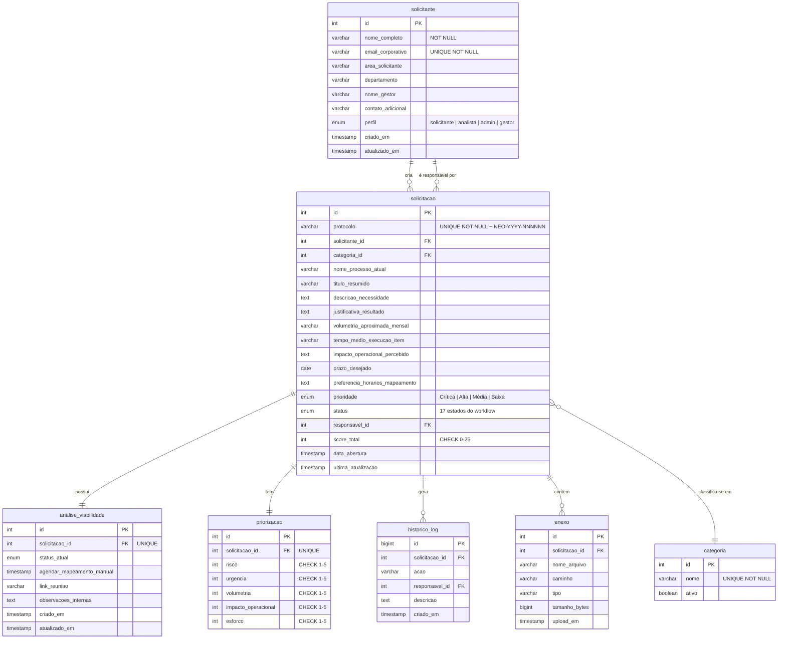

# Modelo de Dados — Sistema NEO

## Diagrama Entidade-Relacionamento (Mermaid)



## Esquema Visual Simplificado

```
┌─────────────────────┐       ┌─────────────────────────────┐
│     solicitante     │       │        categoria            │
├─────────────────────┤       ├─────────────────────────────┤
│ PK  id              │──┐    │ PK  id                      │
│     nome_completo   │  │    │     nome              (UNQ) │
│     email_corporativo│  │    │     ativo                   │
│     area_solicitante│  │    └──────────┬──────────────────┘
│     departamento    │  │               │
│     nome_gestor     │  │               │
│     contato_adicional│  │    ┌──────────┘
│     perfil (enum)   │  │    │
│     criado_em       │  │    │
│     atualizado_em   │  │    │
└──────────┬──────────┘  │    │
           │             │    │
           │ FK          │ FK │
           ▼             │    ▼
┌─────────────────────────┴────┴───────────────────────────┐
│                      solicitacao                         │
├──────────────────────────────────────────────────────────┤
│ PK  id                                                   │
│     protocolo                    (UNQ ~ NEO-YYYY-NNNNNN) │
│     solicitante_id        FK                             │
│     categoria_id          FK                             │
│     nome_processo_atual                                   │
│     titulo_resumido                                       │
│     descricao_necessidade                                 │
│     justificativa_resultado                               │
│     volumetria_aproximada_mensal                          │
│     tempo_medio_execucao_item                             │
│     impacto_operacional_percebido                         │
│     prazo_desejado                                        │
│     preferencia_horarios_mapeamento                       │
│     prioridade (enum)                                     │
│     status (enum)                                         │
│     responsavel_id            FK ──> solicitante          │
│     score_total               CHECK 0-25                  │
│     data_abertura                                         │
│     ultima_atualizagem                                    │
└──────┬────────────┬──────────────┬───────────────────────┘
       │            │              │
       │ 1:1        │ 1:1          │ 1:N
       ▼            ▼              ▼
┌──────────────┐ ┌──────────┐ ┌────────────────┐
│ analise_     │ │          │ │ historico_log  │
│ viabilidade  │ │ priorizacao │                │
├──────────────┤ ├──────────┤ ├────────────────┤
│ PK  id       │ │ PK  id   │ │ PK  id (BIG)   │
│ FK  solicit. │ │ FK  solicit│ │ FK  solicit.   │
│     (UNQ)    │ │    (UNQ) │ │     acao       │
│     status   │ │ risco   │ │     responsavel │
│     agenda   │ │ urgencia│ │     descricao   │
│     link     │ │ volumet │ │     criado_em   │
│     obs      │ │ impacto │ └────────────────┘
│     criado_em│ │ esforco │
│     atualiz. │ └──────────┘
└──────────────┘
                   ┌──────────────┐
                   │    anexo     │
                   ├──────────────┤
                   │ PK  id       │
                   │ FK  solicit. │
                   │     nome     │
                   │     caminho  │
                   │     tipo     │
                   │     tamanho  │
                   │     upload   │
                   └──────────────┘
```

## Cardinalidades

| Origem | Destino | Cardinalidade | Motivo |
|--------|---------|---------------|--------|
| `solicitante` | `solicitacao` | 1:N | Um solicitante pode criar várias solicitações |
| `solicitante` | `solicitacao` (responsavel) | 1:N | Um analista/admin pode ser responsável por N solicitações |
| `solicitacao` | `analise_viabilidade` | 1:1 | Cada solicitação tem no máximo uma análise |
| `solicitacao` | `priorizacao` | 1:1 | Cada solicitação tem um único cálculo de priorização |
| `solicitacao` | `historico_log` | 1:N | Cada solicitação gera N logs de auditoria |
| `solicitacao` | `anexo` | 1:N | Cada solicitação pode ter N anexos |
| `solicitacao` | `categoria` | N:1 | Cada solicitação pertence a uma categoria |

## Convenções Adotadas

- **Chaves primárias:** `id SERIAL` em todas as tabelas
- **Chaves estrangeiras:** nome da tabela referenciada + `_id`
- **Índices:** criados para todas as FKs e campos de busca frequente (status, prioridade, data)
- **Enums PostgreSQL:** garantem integridade dos valores de perfil, prioridade e status
- **Trigger de protocolo:** gera automaticamente o formato `NEO-YYYY-NNNNNN` na inserção
- **Trigger de atualização:** mantém `atualizado_em` sincronizado automaticamente
