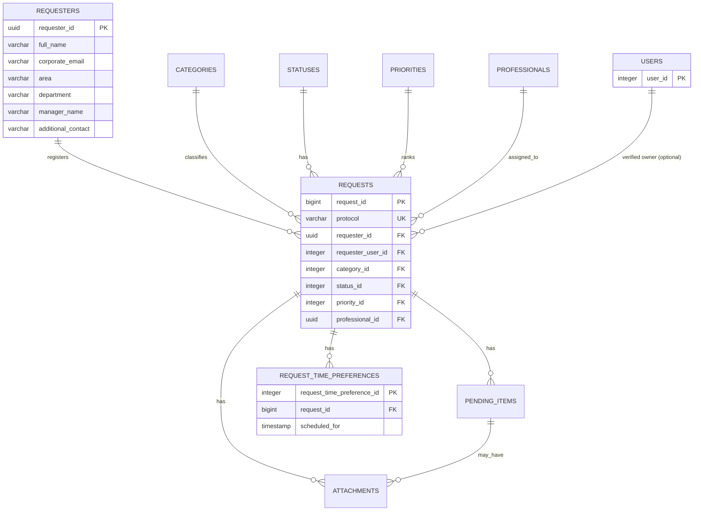

# Persistência dos Pedidos (Solicitações)

## Issue relacionada

Issue #23 — BANCO DE DADOS - Modelar persistência das solicitações

## Objetivo

Documentar a estrutura de banco de dados preparada para armazenar as solicitações
do fluxo do Solicitante do NEO, incluindo o cadastro do solicitante, as tabelas de
referência, a solicitação, suas pendências, anexos e preferências de horário, com
seus relacionamentos, restrições, índices, regras de integridade e decisões de
modelagem.

O contrato de comunicação Frontend ↔ Backend que orienta esta modelagem está em
[`docs/solicitations-api-requests-0_4.md`](../solicitations-api-requests-0_4.md).

## Visão geral do modelo

A persistência das solicitações é composta por nove tabelas:

- `requesters`: dados do solicitante do pedido;
- `categories`: categorias da demanda (dados de referência);
- `statuses`: matriz pública de status (dados de referência);
- `priorities`: faixas de priorização (dados de referência);
- `details_professional`: responsáveis técnicos que podem ser atribuídos (1:1 com `users`);
- `requests`: a solicitação e seus blocos de formulário e fluxo;
- `pending_items`: pendências abertas por analistas;
- `attachments`: anexos vinculados ao pedido e, opcionalmente, a uma pendência;
- `request_time_preferences`: até três horários de preferência para mapeamento.

O relacionamento central é a `requests`: cada solicitação referencia exatamente um
`requester`, uma `category` e um `status`, opcionalmente uma `priority`, um
`professional`, e — quando criada por usuário autenticado (issue #53) — uma conta
(`user`); além de possuir zero ou muitos `pending_items`, `attachments` e
`request_time_preferences`.

### Diagrama de relacionamento



Onde: `PK` = Primary Key; `FK` = Foreign Key; `UK` = Unique Key.

## Tabela `requesters`

Armazena os dados do solicitante informados no bloco `requester` do formulário.

### Estrutura

| Campo                | Tipo         | Obrigatório | Restrição / Default                      | Finalidade                           |
| -------------------- | ------------ | ----------- | ---------------------------------------- | ------------------------------------ |
| `requester_id`       | UUID         | Sim         | Primary Key, `gen_random_uuid()`         | Identificador interno do solicitante |
| `full_name`          | VARCHAR(150) | Sim         | NOT NULL                                 | Nome completo — limite 150           |
| `corporate_email`    | VARCHAR(254) | Sim         | NOT NULL; UNIQUE (`uk_requesters_email`) | E-mail corporativo — limite 254      |
| `area`               | VARCHAR(100) | Sim         | NOT NULL; indexado                       | Área do solicitante — limite 100     |
| `department`         | VARCHAR(100) | Não         | NULL permitido                           | Departamento — limite 100            |
| `manager_name`       | VARCHAR(150) | Sim         | NOT NULL                                 | Gestor responsável — limite 150      |
| `additional_contact` | VARCHAR(100) | Não         | NULL permitido                           | Contato adicional — limite 100       |
| `created_at`         | TIMESTAMPTZ  | Sim         | DEFAULT `CURRENT_TIMESTAMP`              | Data e hora de criação do registro   |

### Restrições

- `full_name`, `corporate_email`, `area` e `manager_name` são obrigatórios;
- `department` e `additional_contact` são opcionais;
- `corporate_email` é único (`uk_requesters_email`), permitindo deduplicar o
  solicitante por e-mail; índice em `area` (`idx_requesters_area`).

## Tabela `categories`

Armazena as categorias da demanda. É uma tabela de referência administrável pelo
módulo de configurações.

### Estrutura

| Campo         | Tipo        | Obrigatório | Restrição / Default                     | Finalidade                 |
| ------------- | ----------- | ----------- | --------------------------------------- | -------------------------- |
| `category_id` | INTEGER     | Sim         | Primary Key, auto increment             | Identificador da categoria |
| `name`        | VARCHAR(80) | Sim         | UNIQUE (`uk_categories_name`)           | Nome — limite 80           |
| `description` | TEXT        | Não         | NULL permitido                          | Descrição da categoria     |
| `status`      | ENUM        | Sim         | `active` / `inactive`; DEFAULT `active` | Situação do cadastro       |
| `created_at`  | TIMESTAMPTZ | Sim         | DEFAULT `CURRENT_TIMESTAMP`             | Data e hora de criação     |

### Restrições

- `name` é único e obrigatório;
- `status` usa o tipo nativo `category_status` com valor padrão `active`;
- índice em `status` (`idx_categories_status`).

## Tabela `statuses`

Armazena a matriz pública de 17 status visíveis ao solicitante.

### Estrutura

| Campo          | Tipo         | Obrigatório | Restrição / Default          | Finalidade                |
| -------------- | ------------ | ----------- | ---------------------------- | ------------------------- |
| `status_id`    | INTEGER      | Sim         | Primary Key, auto increment  | Identificador do status   |
| `order_number` | INTEGER      | Sim         | UNIQUE (`uk_statuses_order`) | Ordem de exibição         |
| `name`         | VARCHAR(100) | Sim         | UNIQUE (`uk_statuses_name`)  | Nome do status            |
| `description`  | TEXT         | Não         | NULL permitido               | Descrição do status       |
| `is_final`     | BOOLEAN      | Sim         | DEFAULT FALSE                | Indica se encerra o fluxo |

### Restrições

- `order_number` e `name` são únicos e obrigatórios;
- `is_final` possui valor padrão `FALSE`.

## Tabela `priorities`

Armazena as faixas de priorização e o peso usado no cálculo do score.

### Estrutura

| Campo            | Tipo         | Obrigatório | Restrição / Default            | Finalidade                                 |
| ---------------- | ------------ | ----------- | ------------------------------ | ------------------------------------------ |
| `priority_id`    | INTEGER      | Sim         | Primary Key, auto increment    | Identificador da faixa                     |
| `level`          | VARCHAR(50)  | Sim         | UNIQUE (`uk_priorities_level`) | Nível: `Baixa`, `Média`, `Alta`, `Crítica` |
| `min_score`      | INTEGER      | Sim         | NOT NULL                       | Limite inferior da faixa                   |
| `max_score`      | INTEGER      | Sim         | NOT NULL                       | Limite superior da faixa                   |
| `default_weight` | DECIMAL(3,2) | Sim         | NOT NULL                       | Peso padrão do cálculo                     |
| `color_code`     | VARCHAR(50)  | Não         | NULL permitido                 | Cor associada                              |
| `description`    | TEXT         | Não         | NULL permitido                 | Descrição da faixa                         |
| `created_at`     | TIMESTAMPTZ  | Sim         | DEFAULT `CURRENT_TIMESTAMP`    | Data e hora de criação                     |

### Restrições

- `level` é único e usa o mesmo vocabulário de `RequestPriority` do contrato
  (`Baixa`, `Média`, `Alta`, `Crítica`).

## Tabela `details_professional`

Dados de rotação dos responsáveis técnicos que podem ser atribuídos às
solicitações. Cada registro é vinculado 1:1 a um usuário do sistema (`users`)
— nome e e-mail vêm de lá, nunca daqui. Criada como `professionals` e
renomeada/ajustada pela migration
`20260917013250_rename_professionals_to_details_professional.js` (issue #50).

### Estrutura

| Campo                   | Tipo         | Obrigatório | Restrição / Default                     | Finalidade                        |
| ----------------------- | ------------ | ----------- | --------------------------------------- | --------------------------------- |
| `professional_id`       | UUID         | Sim         | Primary Key, `gen_random_uuid()`        | Identificador do responsável      |
| `user_id`               | INTEGER      | Sim         | NOT NULL; UNIQUE; FK `users.user_id`    | Usuário do sistema correspondente |
| `job_title`             | VARCHAR(100) | Não         | NULL permitido                          | Cargo/função (não é o perfil)     |
| `specialties`           | TEXT         | Não         | NULL permitido                          | Especialidades                    |
| `attended_category_ids` | TEXT         | Não         | NULL permitido                          | Categorias atendidas              |
| `status`                | ENUM         | Sim         | `active` / `inactive`; DEFAULT `active` | Está na rotação de atribuição     |
| `capacity`              | INTEGER      | Sim         | DEFAULT 5                               | Capacidade de atendimento         |
| `notes`                 | TEXT         | Não         | NULL permitido                          | Observações internas              |

### Restrições

- `user_id` referencia `users.user_id` com `ON DELETE RESTRICT` e é `UNIQUE`
  (`uk_details_professional_user`) — garante o 1:1;
- `status` usa o tipo nativo `professional_status` com valor padrão `active`.
  É independente de `users.is_active`: um analista em licença fica `inactive`
  aqui e continua logando;
- índice em `status` (`idx_details_professional_status`).

Elegibilidade para atribuição (ver `docs/requests-assignment-contract.md`):
`status = 'active'` **e** `users.is_active` **e** perfil `analista`/`gestor`.

## Tabela `requests`

Armazena a solicitação, com uma coluna por campo dos blocos do formulário e as
colunas de fluxo. Cada linha é um pedido, identificado pelo protocolo e pelo
identificador interno sequencial.

### Identificação e blocos do formulário

| Campo                          | Tipo          | Obrigatório | Restrição / Default                            | Finalidade                                 |
| ------------------------------ | ------------- | ----------- | ---------------------------------------------- | ------------------------------------------ |
| `request_id`                   | BIGINT        | Sim         | Primary Key, `nextval('requests_request_seq')` | Identificador interno sequencial           |
| `protocol`                     | VARCHAR(25)   | Sim         | UNIQUE (`uk_requests_protocol`), NOT NULL      | Protocolo público FPE/Feistel              |
| `requester_id`                 | UUID          | Sim         | Foreign Key, NOT NULL                          | Solicitante                                |
| `title`                        | VARCHAR(150)  | Sim         | NOT NULL                                       | Título — limite 150                        |
| `request_type`                 | VARCHAR(80)   | Sim         | NOT NULL                                       | Tipo de solicitação — limite 80            |
| `process_name`                 | VARCHAR(150)  | Sim         | NOT NULL                                       | Nome do processo — limite 150              |
| `need_description`             | VARCHAR(4000) | Sim         | NOT NULL                                       | Descrição da necessidade — limite 4.000    |
| `problem_opportunity`          | VARCHAR(4000) | Sim         | NOT NULL                                       | Problema/oportunidade — limite 4.000       |
| `expected_result`              | VARCHAR(4000) | Sim         | NOT NULL                                       | Resultado esperado — limite 4.000          |
| `justification`                | VARCHAR(4000) | Sim         | NOT NULL                                       | Justificativa — limite 4.000               |
| `process_description`          | VARCHAR(4000) | Sim         | NOT NULL                                       | Descrição do processo atual — limite 4.000 |
| `process_steps`                | VARCHAR(4000) | Sim         | NOT NULL                                       | Etapas do processo — limite 4.000          |
| `systems_used`                 | VARCHAR(255)  | Sim         | NOT NULL                                       | Sistemas utilizados — limite 255           |
| `execution_frequency`          | VARCHAR(50)   | Sim         | NOT NULL                                       | Frequência — limite 50                     |
| `approximate_volume`           | VARCHAR(100)  | Sim         | NOT NULL                                       | Volumetria — limite 100                    |
| `people_involved`              | INTEGER       | Sim         | NOT NULL, CHECK `> 0`                          | Pessoas envolvidas                         |
| `average_duration`             | VARCHAR(60)   | Sim         | NOT NULL                                       | Tempo médio — limite 60                    |
| `estimated_monthly_effort`     | DECIMAL(10,2) | Sim         | NOT NULL, CHECK `>= 0`                         | Esforço mensal em horas                    |
| `has_manual_controls`          | BOOLEAN       | Sim         | NOT NULL                                       | Existem controles manuais                  |
| `manual_controls_detail`       | VARCHAR(1000) | Não         | NULL permitido                                 | Detalhe dos controles — limite 1.000       |
| `main_risks`                   | VARCHAR(2000) | Sim         | NOT NULL                                       | Riscos — limite 2.000                      |
| `client_impact`                | VARCHAR(2000) | Sim         | NOT NULL                                       | Impacto no cliente — limite 2.000          |
| `operational_impact`           | ENUM          | Sim         | `Baixo`/`Médio`/`Alto`/`Crítico`; NOT NULL     | Impacto operacional                        |
| `desired_deadline`             | DATE          | Sim         | NOT NULL                                       | Prazo desejado                             |
| `perceived_criticality`        | ENUM          | Sim         | `Baixa`/`Média`/`Alta`/`Crítica`; NOT NULL     | Criticidade percebida                      |
| `has_process_documentation`    | BOOLEAN       | Não         | NULL permitido                                 | Existe documentação do processo            |
| `process_documentation_detail` | VARCHAR(1000) | Não         | NULL permitido                                 | Detalhe — limite 1.000                     |
| `has_similar_solution`         | BOOLEAN       | Não         | NULL permitido                                 | Existe solução semelhante                  |
| `similar_solution_detail`      | VARCHAR(1000) | Não         | NULL permitido                                 | Detalhe — limite 1.000                     |
| `depends_on_other_areas`       | BOOLEAN       | Não         | NULL permitido                                 | Depende de outras áreas                    |
| `other_areas_detail`           | VARCHAR(1000) | Não         | NULL permitido                                 | Detalhe — limite 1.000                     |
| `handles_restricted_info`      | BOOLEAN       | Não         | NULL permitido                                 | Trata informações restritas                |
| `restricted_info_detail`       | VARCHAR(1000) | Não         | NULL permitido                                 | Detalhe — limite 1.000                     |
| `additional_notes`             | VARCHAR(2000) | Não         | NULL permitido                                 | Observações adicionais — limite 2.000      |

### Colunas de fluxo e triagem

| Campo                     | Tipo         | Obrigatório | Restrição / Default                                                          | Finalidade                                                                           |
| ------------------------- | ------------ | ----------- | ---------------------------------------------------------------------------- | ------------------------------------------------------------------------------------ |
| `category_id`             | INTEGER      | Sim         | Foreign Key, NOT NULL                                                        | Categoria da demanda                                                                 |
| `status_id`               | INTEGER      | Sim         | Foreign Key, NOT NULL                                                        | Status atual do pedido                                                               |
| `priority_id`             | INTEGER      | Não         | Foreign Key, NULL permitido                                                  | Prioridade, preenchida após a triagem                                                |
| `preliminary_complexity`  | VARCHAR(50)  | Não         | NULL permitido                                                               | Complexidade preliminar                                                              |
| `screening_result`        | VARCHAR(50)  | Não         | NULL permitido                                                               | Resultado da triagem                                                                 |
| `screening_justification` | TEXT         | Não         | NULL permitido                                                               | Justificativa da triagem                                                             |
| `identified_risks`        | TEXT         | Não         | NULL permitido                                                               | Riscos identificados                                                                 |
| `professional_id`         | UUID         | Não         | Foreign Key, NULL permitido                                                  | Responsável técnico atribuído                                                        |
| `requester_user_id`       | INTEGER      | Não         | Foreign Key NULL permitido → `users.user_id`, `ON DELETE SET NULL`, indexada | Conta autenticada que criou a solicitação (modo autenticado); `NULL` no modo público |
| `internal_notes`          | TEXT         | Não         | NULL permitido                                                               | Notas internas                                                                       |
| `next_steps`              | TEXT         | Não         | NULL permitido                                                               | Próximos passos                                                                      |
| `created_by`              | VARCHAR(254) | Sim         | NOT NULL                                                                     | Usuário/e-mail de criação                                                            |
| `created_at`              | TIMESTAMPTZ  | Sim         | DEFAULT `CURRENT_TIMESTAMP`                                                  | Data e hora de criação                                                               |
| `updated_by`              | VARCHAR(254) | Não         | NULL permitido                                                               | Usuário/e-mail da última atualização                                                 |
| `updated_at`              | TIMESTAMPTZ  | Não         | NULL permitido                                                               | Data e hora da última atualização                                                    |
| `last_external_update_at` | TIMESTAMPTZ  | Não         | NULL permitido                                                               | Última atualização visível ao solicitante                                            |
| `last_technical_message`  | TEXT         | Não         | NULL permitido                                                               | Última mensagem pública do responsável                                               |
| `estimated_completion`    | DATE         | Não         | NULL permitido                                                               | Previsão de conclusão (`yyyy-mm-dd`)                                                 |
| `meeting_scheduled_for`   | TIMESTAMPTZ  | Não         | NULL permitido                                                               | Data/hora da reunião de mapeamento                                                   |
| `meeting_link`            | TEXT         | Não         | NULL permitido                                                               | Link de acesso à reunião                                                             |

### Restrições

- `requester_id` referencia `requesters.requester_id` com `ON DELETE RESTRICT`;
- `requester_user_id` referencia `users.user_id` com `ON DELETE SET NULL`
  (anulável — solicitações públicas não vinculam conta);
- `category_id` referencia `categories.category_id` com `ON DELETE RESTRICT`;
- `status_id` referencia `statuses.status_id` com `ON DELETE RESTRICT`;
- `priority_id` referencia `priorities.priority_id` com `ON DELETE RESTRICT`;
- `professional_id` referencia `details_professional.professional_id` com `ON DELETE SET NULL`;
- `people_involved > 0` (`ck_requests_people_involved`);
- `estimated_monthly_effort >= 0` (`ck_requests_estimated_monthly_effort`);
- índices: `idx_requests_created_at`, `idx_requests_status`, `idx_requests_category`,
  `idx_requests_priority`, `idx_requests_professional`, `idx_requests_requester`,
  `idx_requests_requester_user`.

### Respostas "Sim/Não (+ detalhamento)"

Os campos derivados de `YesNoDetail` são persistidos como um par: uma flag
booleana e uma coluna de detalhe (`VARCHAR(1000)`). A string de detalhe só é
preenchida quando a resposta é afirmativa; a obrigatoriedade do detalhe é
responsabilidade da aplicação.

## Tabela `pending_items`

Armazena as pendências abertas por analistas durante a triagem.

### Estrutura

| Campo                      | Tipo         | Obrigatório | Restrição / Default                                     | Finalidade                  |
| -------------------------- | ------------ | ----------- | ------------------------------------------------------- | --------------------------- |
| `pending_item_id`          | UUID         | Sim         | Primary Key, `gen_random_uuid()`                        | Identificador da pendência  |
| `request_id`               | BIGINT       | Sim         | Foreign Key, NOT NULL                                   | Solicitação associada       |
| `type`                     | ENUM         | Sim         | `field_edit`/`attachment_upload`/`information`/`action` | Tipo da pendência           |
| `description`              | TEXT         | Sim         | NOT NULL                                                | Descrição da pendência      |
| `requested_fields`         | JSONB        | Não         | NULL permitido                                          | Campos solicitados          |
| `requires_attachment`      | BOOLEAN      | Sim         | DEFAULT FALSE                                           | Exige anexo                 |
| `expected_attachment_type` | VARCHAR(100) | Não         | NULL permitido                                          | Formato esperado do anexo   |
| `is_visible_to_requester`  | BOOLEAN      | Sim         | DEFAULT TRUE                                            | Visível ao solicitante      |
| `status`                   | ENUM         | Sim         | `open`/`overdue`/`resolved`; DEFAULT `open`             | Situação da pendência       |
| `deadline`                 | DATE         | Não         | NULL permitido                                          | Prazo                       |
| `created_by`               | VARCHAR(100) | Sim         | NOT NULL                                                | Usuário/e-mail de criação   |
| `created_at`               | TIMESTAMPTZ  | Sim         | DEFAULT `CURRENT_TIMESTAMP`                             | Data e hora de criação      |
| `resolution`               | TEXT         | Não         | NULL permitido                                          | Resolução                   |
| `resolved_by`              | VARCHAR(100) | Não         | NULL permitido                                          | Usuário/e-mail da resolução |
| `resolved_at`              | TIMESTAMPTZ  | Não         | NULL permitido                                          | Data e hora da resolução    |

### Restrições

- `request_id` referencia `requests.request_id` com `ON DELETE CASCADE`;
- `type` usa o tipo nativo `pending_item_type`;
- `status` usa o tipo nativo `pending_item_status` com valor padrão `open`;
- índices: `idx_pending_items_request`, `idx_pending_items_status`,
  `idx_pending_items_visibility`.

## Tabela `attachments`

Armazena os metadados dos anexos derivados no servidor a partir das partes
binárias do `POST /requests`.

### Estrutura

| Campo             | Tipo          | Obrigatório | Restrição / Default              | Finalidade                         |
| ----------------- | ------------- | ----------- | -------------------------------- | ---------------------------------- |
| `attachment_id`   | UUID          | Sim         | Primary Key, `gen_random_uuid()` | Identificador do anexo             |
| `request_id`      | BIGINT        | Sim         | Foreign Key, NOT NULL            | Solicitação associada              |
| `pending_item_id` | UUID          | Não         | Foreign Key, NULL permitido      | Pendência associada, quando houver |
| `file_name`       | VARCHAR(255)  | Sim         | NOT NULL                         | Nome original — limite 255         |
| `file_path`       | VARCHAR(1000) | Sim         | NOT NULL                         | Caminho de armazenamento           |
| `content_type`    | VARCHAR(100)  | Sim         | NOT NULL, CHECK de formato       | MIME do anexo                      |
| `size_bytes`      | BIGINT        | Sim         | NOT NULL, CHECK de tamanho       | Tamanho em bytes                   |
| `is_restricted`   | BOOLEAN       | Sim         | DEFAULT FALSE                    | Anexo restrito                     |
| `uploaded_by`     | VARCHAR(254)  | Não         | NULL permitido                   | Usuário/e-mail do envio            |
| `uploaded_at`     | TIMESTAMPTZ   | Sim         | DEFAULT `CURRENT_TIMESTAMP`      | Data e hora do envio               |

### Restrições

- `request_id` referencia `requests.request_id` com `ON DELETE CASCADE`;
- `pending_item_id` referencia `pending_items.pending_item_id` com `ON DELETE SET NULL`;
- `size_bytes > 0 AND size_bytes <= 10485760` (`ck_attachments_size_bytes` — 10MB);
- `content_type` restrito a PDF, DOCX, XLSX, PNG e JPG (`ck_attachments_content_type`);
- índices: `idx_attachments_request`, `idx_attachments_pending_item`,
  `idx_attachments_restricted`, `idx_attachments_uploaded_at`.

## Tabela `request_time_preferences`

Armazena as até três opções de data/hora declaradas pelo solicitante para o
mapeamento (`schedulePreferences`).

### Estrutura

| Campo                        | Tipo        | Obrigatório | Restrição / Default         | Finalidade                 |
| ---------------------------- | ----------- | ----------- | --------------------------- | -------------------------- |
| `request_time_preference_id` | INTEGER     | Sim         | Primary Key, auto increment | Identificador do horário   |
| `request_id`                 | BIGINT      | Sim         | Foreign Key, NOT NULL       | Solicitação associada      |
| `scheduled_for`              | TIMESTAMP   | Sim         | NOT NULL                    | Data e hora no formato ISO |
| `created_at`                 | TIMESTAMPTZ | Sim         | DEFAULT `CURRENT_TIMESTAMP` | Data e hora de criação     |

### Restrições

- `request_id` referencia `requests.request_id` com `ON DELETE CASCADE`;
- `(request_id, scheduled_for)` é único (`uk_request_time_preferences_slot`);
- o limite de três opções por solicitação não é expresso no banco e deve ser
  validado pela aplicação (contrato `POST /requests`).

## Protocolo

O identificador público de rastreio é o **protocolo**, uma coluna de texto
(`protocol VARCHAR(25)`, `UNIQUE`, `NOT NULL`). Ele é **não enumerável** e
derivado do `request_id` interno por FPE/Feistel (ex.: `MAAT-8K3P-9X2M`),
conforme o contrato (`docs/solicitations-api-requests-0_4.md`, seção 1 e
observações).

- o `request_id` é gerado por uma sequence dedicada (`requests_request_seq`),
  garantindo unicidade sob concorrência sem expor o sequencial;
- a geração do protocolo é responsabilidade da aplicação, que pré-aloca o
  `request_id` com `nextval`, calcula o código FPE e o grava no mesmo `INSERT`;
- o domínio do FPE deve ser dimensionado acima do volume esperado de IDs; a
  restrição `UNIQUE` da coluna atua como rede de segurança contra colisões;
- buracos na sequência (valores consumidos em transações desfeitas) são
  aceitáveis, pois o `request_id` é um identificador interno.

## Decisões de modelagem

- **Solicitante em tabela própria:** `requesters` evita repetir dados do
  solicitante a cada pedido e permite o acompanhamento por e-mail.
- **Solicitante único por e-mail:** `corporate_email` é `UNIQUE`
  (`uk_requesters_email`), permitindo `upsert` do solicitante no cadastro.
- **`created_by` com o e-mail do solicitante:** no `POST /requests` público não
  há usuário autenticado; a coluna guarda o e-mail normalizado do solicitante
  (por isso foi alargada para `VARCHAR(254)`).
- **Vínculo com a conta autenticada (`requester_user_id`):** a solicitação criada
  por usuário autenticado referencia `users.user_id` (coluna anulável, issue #53).
  O snapshot público dos dados continua em `requesters`; a conta é a propriedade
  verificável. Qualquer perfil pode solicitar (`solicitante`, `analista`,
  `gestor`, `administrador`) — não há restrição de perfil no banco. A
  coincidência de e-mail entre conta e snapshot é invariante da aplicação, não do
  banco. Não há `UNIQUE`: um usuário pode possuir múltiplas solicitações.
- **Exclusão de usuário:** `requester_user_id` usa `ON DELETE SET NULL` — apagar
  a conta preserva a solicitação e a rastreabilidade (`requesters` + `created_by`
  continuam), mesmo padrão de `professional_id` e `system_settings.updated_by`.
- **Categorias, status e prioridades como referência:** normalizam os domínios
  `category`, `status` e `priority` e viabilizam o CRUD de configurações.
- **`request_id` sequencial + protocolo FPE:** o identificador interno é
  sequencial e o protocolo público é não enumerável, atendendo à proteção
  contra varredura sequencial (IDOR).
- **Obrigatoriedade e limites espelhados no banco:** os campos obrigatórios do
  contrato são `NOT NULL` e os limites de caracteres são refletidos em
  `VARCHAR`, conforme a seção "Observações" do contrato.
- **`YesNoDetail` como flag + detalhe:** a resposta "Sim/Não (+ detalhamento)"
  vira duas colunas; o detalhe é a própria resposta positiva.
- **Preferências de horário em tabela filha:** `schedulePreferences` é uma lista;
  cada horário vira uma linha, com `ON DELETE CASCADE`.
- **Prioridade nula até a triagem:** `priority_id` é nullable até o processo de
  priorização preencher o nível.
- **Exclusão de anexos:** `attachments.request_id` usa `ON DELETE CASCADE`
  (anexo não existe sem o pedido), enquanto a referência a `pending_items` usa
  `ON DELETE SET NULL`.
- **Ambiente:** o banco de desenvolvimento usa PostgreSQL 18 em Docker
  (`postgres:18-alpine`, conforme o `README.md`). O schema utiliza `gen_random_uuid()`
  e enums nativos, disponíveis na versão.

## Fora do escopo

Não fazem parte desta Issue:

- geração do protocolo FPE/Feistel (issue própria);
- validação de payload, limites e partes `multipart/form-data`;
- endpoints de cadastro, listagem, consulta e edição de solicitações;
- tabelas e regras de triagem, priorização, fila, auditoria e a modelagem
  completa do mapeamento (duração, modalidade, local, participantes,
  confirmação); a migration `202609100014` adiciona apenas os campos mínimos
  de reunião (`meeting_scheduled_for`, `meeting_link`) exigidos pelo painel
  público de acompanhamento;
- implementação automática de `updated_at`;
- normalização de `attended_category_ids`;
- padronização do vocabulário de `TriageResult` nos campos de triagem.

## Migrations

A estrutura é controlada por migrations do Knex, executadas após as migrations de
autenticação (diretório `migrations/` na raiz, fora do escopo desta seção), na
seguinte ordem:

1. `202609100001_create_requesters.js`
2. `202609100002_create_categories.js`
3. `202609100003_create_priorities.js`
4. `202609100004_create_statuses.js`
5. `202609100005_create_professionals.js`
6. `202609100006_create_requests.js`
7. `202609100007_create_pending_items.js`
8. `202609100008_create_attachments.js`
9. `202609100009_create_request_time_preferences.js`
10. `202609100010_unique_requesters_email.js`
11. `202609100011_requests_created_by_length.js`
12. `202609100012_email_columns_length.js`
13. `202609100013_insert_reference_data.js`
14. `202609100014_add_public_tracking_fields_to_requests.js`
15. `20260911015500_alter_priorities_score_columns.js`
16. `20260912003734_create_criteria.js`
17. `20260914000000_add_priorities_score_checks.js`
18. `20260916120000_add_requester_user_fk_to_requests.js` (issue #53)
19. `20260917013250_rename_professionals_to_details_professional.js` (depende de `users`)

A ordem respeita as dependências: as tabelas de referência e `requesters` são
criadas antes de `requests`, e as tabelas filhas (`pending_items`, `attachments`,
`request_time_preferences`) depois de `requests`.

### Migração da issue #53 — vínculo com `users`

`20260916120000_add_requester_user_fk_to_requests.js` adiciona à `requests` a
coluna `requester_user_id` (`INTEGER`, anulável, FK → `users.user_id` com
`ON DELETE SET NULL`) e o índice `idx_requests_requester_user`. O `down`
remove o índice e a coluna — não altera nenhuma migration já integrada.

### Dados de referência

Os seeds em `seeds/requester_request/` populam dados de desenvolvimento para
`requesters`, `criteria`, `priorities`, `statuses`, `users`, `details_professional`, `requests`,
`pending_items`, `attachments`, `request_time_preferences` e
`prioritization_evaluations`. O seed de `requests` ajusta a sequence `requests_request_seq` após inserir IDs explícitos,
evitando colisão com o próximo `nextval`, e preenche os campos do painel público
(`last_technical_message`, `estimated_completion`, `meeting_scheduled_for`,
`meeting_link`). O seed de `users` (`004_users.js`) roda antes de `requests`
para satisfazer a FK da issue #53. A partir dessa issue, o seed de `requests`
também demonstra os dois modos de origem: solicitações públicas
(`requester_user_id = NULL`) e autenticadas (`requester_user_id`
preenchido, incluindo perfil interno solicitando).

### Execução

```bash
npm run migrate:latest
npm run migrate:rollback
npm run migrate:make -- migration-name
```

## Validações

### Realizadas

- `npm run typecheck` e `npm run lint` sem erros;
- migrations e seeds validados com Prettier;
- nomes técnicos em inglês, conforme o padrão do projeto;
- `npm run migrate:latest` executado (banco novo: `28 migrations` em batch 1) e
  estrutura conferida no banco;
- `migrate:down` da migration da issue #53 executado (coluna, índice e FK
  removidos sem resíduos) e reaplicado;
- `npm run seed:run` executado (`10 seeds`), demonstrando os dois modos de origem;
- revisão da modelagem por outro integrante (backend) concluída.

### Pendentes

- registrar a evidência da geração do protocolo FPE/Feistel na issue do gerador;
- integração de aplicação: gravar `requester_user_id` no fluxo autenticado
  (fora do escopo da issue #53).

## Status da Issue

A estrutura de persistência, as migrations de schema, os seeds de
desenvolvimento, a documentação e as evidências de migrate/rollback estão
concluídas para a issue #53 (vínculo `requests.requester_user_id` → `users`),
incluindo a revisão do relacionamento.
