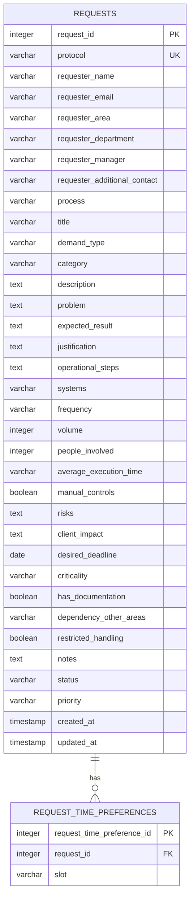

# Persistência dos Pedidos (Solicitações)

## Issue relacionada

Issue #23 — BANCO DE DADOS - Modelar persistência das solicitações

## Objetivo

Documentar a estrutura de banco de dados preparada para armazenar as solicitações do fluxo do Tirador de Pedidos do NEO, incluindo as tabelas `requests` e `request_time_preferences`, a sequência de geração do protocolo, seus relacionamentos, restrições, índices, regras de integridade e decisões de modelagem.

## Visão geral do modelo

A persistência das solicitações é composta por duas tabelas:

- `requests`: armazena a solicitação completa em formato largo, 1:1 com os blocos do formulário, mais as colunas de fluxo (`protocol`, `status`, `priority`, `created_at`, `updated_at`);
- `request_time_preferences`: tabela filha que armazena os horários de preferência do solicitante para o mapeamento.

O relacionamento é **1:N**: uma solicitação pode possuir vários horários, enquanto cada horário pertence a uma única solicitação.

### Diagrama de relacionamento



Onde: `PK` = Primary Key; `FK` = Foreign Key; `UK` = Unique Key.

## Tabela `requests`

Armazena a solicitação completa. Cada linha é um pedido, identificado pelo protocolo gerado automaticamente.

### Identificação e blocos do formulário

| Campo                          | Tipo         | Obrigatório | Restrição / Default                        | Finalidade                                      |
| ------------------------------ | ------------ | ----------- | ------------------------------------------ | ----------------------------------------------- |
| `request_id`                   | INTEGER      | Sim         | Primary Key, auto increment                | Identificador interno da solicitação            |
| `protocol`                     | VARCHAR(20)  | Sim         | UNIQUE, NOT NULL, DEFAULT da sequência     | Protocolo público, único e gerado por sequência |
| `requester_name`               | VARCHAR(150) | Não         | NULL permitido                             | Nome do solicitante                             |
| `requester_email`              | VARCHAR(254) | Não         | NULL permitido; normalizado para minúsculo | E-mail do solicitante                           |
| `requester_area`               | VARCHAR(100) | Não         | NULL permitido                             | Área do solicitante                             |
| `requester_department`         | VARCHAR(100) | Não         | NULL permitido                             | Departamento do solicitante                     |
| `requester_manager`            | VARCHAR(150) | Não         | NULL permitido                             | Gestor do solicitante                           |
| `requester_additional_contact` | VARCHAR(50)  | Não         | NULL permitido                             | Contato adicional                               |
| `process`                      | VARCHAR(150) | Não         | NULL permitido                             | Processo associado à demanda                    |
| `title`                        | VARCHAR(255) | Não         | NULL permitido                             | Título da demanda                               |
| `demand_type`                  | VARCHAR(60)  | Não         | NULL permitido                             | Tipo da demanda                                 |
| `category`                     | VARCHAR(60)  | Não         | NULL permitido; indexada                   | Categoria (filtro)                              |
| `description`                  | TEXT         | Não         | NULL permitido                             | Descrição da necessidade                        |
| `problem`                      | TEXT         | Não         | NULL permitido                             | Problema identificado                           |
| `expected_result`              | TEXT         | Não         | NULL permitido                             | Resultado esperado                              |
| `justification`                | TEXT         | Não         | NULL permitido                             | Justificativa                                   |
| `operational_steps`            | TEXT         | Não         | NULL permitido                             | Etapas do processo atual                        |
| `systems`                      | VARCHAR(255) | Não         | NULL permitido                             | Sistemas envolvidos                             |
| `frequency`                    | VARCHAR(60)  | Não         | NULL permitido                             | Frequência de execução                          |
| `volume`                       | INTEGER      | Não         | NULL permitido                             | Volumetria                                      |
| `people_involved`              | INTEGER      | Não         | NULL permitido                             | Pessoas envolvidas                              |
| `average_execution_time`       | VARCHAR(30)  | Não         | NULL permitido                             | Tempo médio de execução (ex.: `2h`)             |
| `manual_controls`              | BOOLEAN      | Não         | NULL permitido                             | Existem controles manuais                       |
| `risks`                        | TEXT         | Não         | NULL permitido                             | Riscos identificados                            |
| `client_impact`                | TEXT         | Não         | NULL permitido                             | Impacto no cliente                              |
| `desired_deadline`             | DATE         | Não         | NULL permitido                             | Prazo desejado                                  |
| `criticality`                  | VARCHAR(30)  | Não         | NULL permitido                             | Criticidade                                     |
| `has_documentation`            | BOOLEAN      | Não         | NULL permitido                             | Existe documentação                             |
| `dependency_other_areas`       | VARCHAR(255) | Não         | NULL permitido                             | Dependência de outras áreas                     |
| `restricted_handling`          | BOOLEAN      | Não         | NULL permitido                             | Tratamento restrito                             |
| `notes`                        | TEXT         | Não         | NULL permitido                             | Observações                                     |

### Colunas de fluxo

| Campo        | Tipo        | Obrigatório | Restrição / Default                    | Finalidade                                |
| ------------ | ----------- | ----------- | -------------------------------------- | ----------------------------------------- |
| `status`     | VARCHAR(60) | Sim         | NOT NULL, DEFAULT `Recebida`; indexada | Status atual do pedido                    |
| `priority`   | VARCHAR(60) | Não         | NULL permitido                         | Prioridade, preenchida após a priorização |
| `created_at` | TIMESTAMP   | Sim         | DEFAULT CURRENT_TIMESTAMP              | Data e hora de criação                    |
| `updated_at` | TIMESTAMP   | Sim         | DEFAULT CURRENT_TIMESTAMP              | Data e hora da última atualização         |

### Índices

| Nome                             | Tipo   | Colunas           | Finalidade                        |
| -------------------------------- | ------ | ----------------- | --------------------------------- |
| `requests_pkey`                  | UNIQUE | `request_id`      | Chave primária                    |
| `requests_protocol_unique`       | UNIQUE | `protocol`        | Garante protocolo único           |
| `requests_requester_email_index` | BTREE  | `requester_email` | Acompanhamento público por e-mail |
| `requests_status_index`          | BTREE  | `status`          | Filtro por status                 |
| `requests_category_index`        | BTREE  | `category`        | Filtro por categoria              |

## Tabela `request_time_preferences`

Armazena os horários de preferência do bloco `preferenciasHorario`. Cada linha é um horário (`HH:MM`) associado a uma solicitação.

| Campo                        | Tipo       | Obrigatório | Restrição / Default         | Finalidade                     |
| ---------------------------- | ---------- | ----------- | --------------------------- | ------------------------------ |
| `request_time_preference_id` | INTEGER    | Sim         | Primary Key, auto increment | Identificador único do horário |
| `request_id`                 | INTEGER    | Sim         | Foreign Key, NOT NULL       | Solicitação associada          |
| `slot`                       | VARCHAR(5) | Sim         | NOT NULL                    | Horário no formato `HH:MM`     |

Restrições:

- `request_id` referencia `requests.request_id` com `ON DELETE CASCADE` (apagar a solicitação apaga os horários);
- `slot` não pode ser nulo.

Índices:

- `request_time_preferences_request_id_index` (BTREE em `request_id`) — agiliza JOINs e o CASCADE.

## Sequência do protocolo

O protocolo é gerado pela sequência dedicada `requests_protocol_seq` (`START 1 INCREMENT 1`).

O default da coluna `requests.protocol` monta o texto:

```sql
'SOL-' || to_char(CURRENT_DATE, 'YYYY') || '-' || lpad(nextval('requests_protocol_seq')::text, 6, '0')
```

Resultado: `SOL-2026-000001`.

A sequência garante unicidade sob concorrência (cada `nextval` é atômico), reforçada pela constraint `UNIQUE` da coluna.

## Decisões de modelagem

- **Solicitação em formato largo:** uma única tabela `requests` com uma coluna por campo do formulário, simplificando cadastro e leitura sem múltiplos JOINs.
- **Lista de horários em tabela filha:** `preferenciasHorario` é uma lista; cada horário vira uma linha da filha, com `ON DELETE CASCADE`.
- **Protocolo por sequência dedicada:** sequência + `UNIQUE` garantem unicidade sob concorrência; o formato incorpora o ano e um sequencial com zero à esquerda.
- **Status inicial:** definido como `Recebida` (default da coluna), conforme proposto na issue — sem divergência.
- **Prioridade nula até a priorização:** a coluna `priority` só é preenchida após o processo de priorização.
- **Categoria como texto:** `category` permanece `varchar` até a criação da tabela de categorias (módulo de configurações) permitir FK.
- **NOT NULL apenas estrutural:** `request_id`, `protocol`, `status`, `created_at`, `updated_at` (e os campos da filha). A validação campo a campo é responsabilidade da aplicação.
- **E-mail normalizado:** `requester_email` deve ser normalizado para minúsculo pela aplicação antes de persistir/consultar.
- **Ambiente:** o banco de desenvolvimento é PostgreSQL 16 em Docker. Recursos posteriores à versão 9.0 podem ser utilizados; o schema atual não depende de nenhum deles.

## Fora do escopo

Não fazem parte desta Issue:

- tabela de categorias (módulo de configurações);
- tabelas de triagem, priorização detalhada, fila, mapeamento e auditoria;
- alterações nas tabelas `users` e `profiles`;
- endpoints de cadastro, listagem, consulta e edição de solicitações;
- validação campo a campo dos blocos do formulário;
- regras de negócio de status e prioridade.

## Migrations

A estrutura é controlada pela migration `create_requests_tables`, executada após as migrations de autenticação.

- `up`: cria a sequência, a tabela `requests`, a tabela filha `request_time_preferences`, os índices e o default de `protocol`;
- `down`: apaga a filha, depois `requests`, depois a sequência (ordem inversa, sem resíduos).

### Execução

```bash
npm run migrate:latest
npm run migrate:rollback
npm run migrate:make -- nome-da-migration
```

## Validações

### Realizadas

- `npm run typecheck`, `npm run lint`, `npm run build` e Prettier sem erros;
- migration validada com ESLint e Prettier;
- execução de `migrate:latest` no PostgreSQL 16 (Docker) com sucesso;
- criação da sequência, das duas tabelas e dos índices conferida no banco;
- geração do protocolo `SOL-2026-000001` ao inserir sem informar a coluna;
- rejeição de duplicidade do protocolo pela constraint `requests_protocol_unique`;
- exclusão em cascata dos horários ao remover a solicitação;
- `migrate:rollback` remove tudo sem resíduos.

### Pendentes

- validar o contrato de persistência com o Backend;
- validar a normalização do e-mail com o Backend;
- solicitar revisão da modelagem por outro integrante.

## Status da Issue

A estrutura de persistência, a sequência de geração do protocolo, os índices e a documentação estão preparadas e validadas no banco de desenvolvimento.

A Issue permanece em validação até a revisão conjunta com o Backend.
