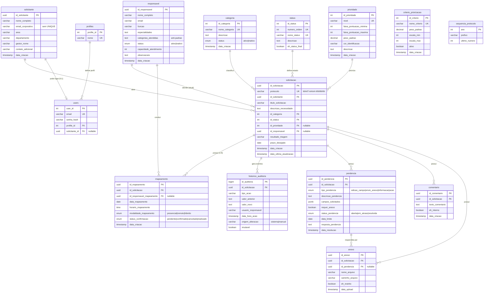

# Documentação da Modelagem de Banco de Dados

## 1\. Visão geral

O banco de dados foi modelado para gerenciar um processo de **solicitação, triagem, mapeamento, análise de viabilidade, priorização e acompanhamento de demandas**.

O fluxo principal é:

1. Um **solicitante** registra uma nova solicitação.
2. A solicitação é vinculada a uma **categoria**.
3. A solicitação recebe um **status** e, posteriormente, uma **prioridade**.
4. Um **responsável** pode ser atribuído para acompanhamento.
5. São agendados e realizados os **mapeamentos** do processo (reuniões de levantamento — **N por solicitação**).
6. Podem ser inseridos **anexos**, **comentários** e **pendências**.
7. Toda movimentação é registrada em **histórico de auditoria** (fonte da verdade, imutável).

> O modelo adota um princípio central: a tabela `SOLICITACAO` mantém apenas o \*\*estado atual\*\* da demanda, enquanto a tabela `HISTORICO\_AUDITORIA` registra \*\*todas as mudanças\*\* ao longo do tempo (escrita dupla em transação). O `protocolo` é a chave de negócio (visível), e `id\_solicitacao` (UUID) é a chave primária da solicitação e das tabelas filhas.

\---

## 2\. Entidades do modelo


| Tabela                  | Finalidade                                                                                        |
| ----------------------- | ------------------------------------------------------------------------------------------------- |
| `solicitante`           | Armazena os dados das pessoas que abrem as solicitações.                                        |
| `categoria`             | Mantém as categorias disponíveis para classificação das solicitações.                       |
| `prioridade`            | Mantém os níveis de prioridade com faixas de pontuação, peso e cor.                           |
| `criterio\_priorizacao` | Define os pesos por critério de priorização (configurados pelo admin).                         |
| `status`                | Mantém os status do fluxo da solicitação, em ordem de execução.                              |
| `responsavel`           | Armazena os profissionais que podem ser atribuídos às solicitações.                           |
| `solicitacao`           | Tabela central do modelo, contendo o estado atual da demanda.                                     |
| `mapeamento`            | Registra os agendamentos/realizações de levantamento (N por solicitação).                     |
| `historico\_auditoria`  | Registra eventos, ações e alterações ocorridas nas solicitações (imutável).                |
| `pendencia`             | Registra pendências de edição, anexo ou ação vinculadas às solicitações, com resolução. |
| `comentario`            | Registra comentários e comunicações associados às solicitações.                             |
| `anexo`                 | Armazena metadados de arquivos anexados às solicitações (inclusive respostas de pendência).   |
| `sequencia\_protocolo`  | Controla a sequência e o prefixo customizável do protocolo (padrão`MAAT`).                     |
| `profiles` / `users`    | Autenticação: perfis e usuários com login (ver`auth.md`).                                      |

\---

# 3\. Dicionário de Dados

## 3.1. Tabela `solicitante`

Armazena as pessoas que abrem solicitações no sistema NEO.


| Campo                | Tipo           | Descrição                                                                                    |
| -------------------- | -------------- | ---------------------------------------------------------------------------------------------- |
| `id\_solicitante`    | `uuid`         | Identificador único do solicitante. Chave primária.                                          |
| `nome\_completo`     | `varchar(255)` | Nome completo do solicitante.                                                                  |
| `email\_corporativo` | `varchar(255)` | E-mail corporativo do solicitante. Sem`UNIQUE` (ver Observações).                            |
| `area`               | `varchar(100)` | Área organizacional à qual o solicitante pertence (dado do momento do envio).                |
| `departamento`       | `varchar(100)` | Departamento do solicitante (dado do momento do envio).                                        |
| `gestor\_nome`       | `varchar(255)` | Nome do gestor responsável pelo solicitante (dado do momento do envio).                       |
| `contato\_adicional` | `varchar(255)` | Canal alternativo de contato, como telefone, Teams ou outro e-mail (dado do momento do envio). |
| `data\_criacao`      | `datetime`     | Data e hora de criação do cadastro.                                                          |

### Observações

* O solicitante pode utilizar o sistema de duas formas, conforme decisão do **admin**:

  * **Sem login (padrão):** a cada solicitação, o solicitante reenvia os dados do formulário; cada envio gera **uma nova linha** de `solicitante` (um envio = um registro) e `email\_corporativo` **não possui `UNIQUE`** — preserva o registro ponto-a-ponto (os dados refletem o momento de cada envio).
  * **Com login:** o admin libera o acesso criando um registro em `users` (ver `auth.md`) e vinculando `users.solicitante\_id` ao `id\_solicitante` canônico da pessoa. Nesse caso, todas as solicitações do usuário **reutilizam o mesmo `id\_solicitante`**.
* Não há campo de perfil de acesso nesta tabela; a autenticação/perfis vivem em `profiles`/`users` (ver `auth.md`).

\---

## 3.2. Tabela `categoria`

Responsável pela classificação das solicitações.


| Campo             | Tipo                      | Descrição                                                             |
| ----------------- | ------------------------- | ----------------------------------------------------------------------- |
| `id\_categoria`   | `int`                     | Identificador único da categoria. Chave primária (`AUTO\_INCREMENT`). |
| `nome\_categoria` | `varchar(100)`            | Nome da categoria. Único.                                              |
| `descricao`       | `text`                    | Descrição da categoria.                                               |
| `status`          | `enum('ativo','inativo')` | Indica se a categoria está disponível para novas solicitações.      |
| `data\_criacao`   | `datetime`                | Data e hora de criação do cadastro.                                   |

### Regras sugeridas

* Categorias inativas não devem ser disponibilizadas para novas solicitações.
* O campo `nome\_categoria` possui restrição `UNIQUE`.

Exemplos de categorias:

* Automação;
* Melhoria de processo;
* Indicador;
* Dashboard ou relatório;
* Análise de dados;
* Padronização;
* Revisão de processo;
* Apoio técnico;
* Estudo de viabilidade;
* Outros.

\---

## 3.3. Tabela `prioridade`

Define os níveis de prioridade e os parâmetros utilizados na classificação das demandas.


| Campo                      | Tipo           | Descrição                                                              |
| -------------------------- | -------------- | ------------------------------------------------------------------------ |
| `id\_prioridade`           | `int`          | Identificador único da prioridade. Chave primária (`AUTO\_INCREMENT`). |
| `nivel`                    | `varchar(50)`  | Nome do nível de prioridade (baixa, média, alta, crítica). Único.    |
| `faixa\_pontuacao\_minima` | `int`          | Limite inferior da faixa de pontuação do nível.                       |
| `faixa\_pontuacao\_maxima` | `int`          | Limite superior da faixa de pontuação do nível.                       |
| `peso\_padrao`             | `decimal(3,2)` | Peso relativo do nível (por exemplo, 0.25 a 1.00).                      |
| `cor\_identificacao`       | `varchar(50)`  | Cor utilizada na interface para identificação visual.                  |
| `descricao`                | `text`         | Descrição do nível de prioridade.                                     |
| `data\_criacao`            | `datetime`     | Data e hora de criação do cadastro.                                    |

### Regras sugeridas

* As faixas de pontuação devem ser contíguas e sem sobreposição entre níveis.
* O campo `nivel` possui restrição `UNIQUE`.

Exemplo de cadastro:


| Nível     | Faixa mínima | Faixa máxima | Peso |
| ---------- | ------------- | ------------- | ---- |
| `baixa`    | 0             | 25            | 0.25 |
| `média`   | 26            | 50            | 0.50 |
| `alta`     | 51            | 75            | 0.75 |
| `crítica` | 76            | 100           | 1.00 |

### Pesos por critério — `CRITERIO\_PRIORIZACAO`

Os **pesos são definidos pelo admin**. Cada critério possui um peso próprio utilizado no cálculo da pontuação:


| Campo            | Tipo           | Descrição                                                                  |
| ---------------- | -------------- | ---------------------------------------------------------------------------- |
| `id\_criterio`   | `int`          | Identificador único do critério. Chave primária (`AUTO\_INCREMENT`).      |
| `nome\_criterio` | `varchar(100)` | Nome do critério (risco, urgência, impacto operacional, esforço). Único. |
| `peso\_padrao`   | `decimal(3,2)` | Peso do critério,**configurado pelo admin** (padrão 1.00).                 |
| `escala\_min`    | `int`          | Valor mínimo da escala de nota (padrão 1).                                 |
| `escala\_max`    | `int`          | Valor máximo da escala de nota (padrão 5).                                 |
| `ativo`          | `boolean`      | Indica se o critério está ativo no cálculo.                               |
| `data\_criacao`  | `datetime`     | Data e hora de criação.                                                    |

Cálculo do score (**normalizado para 0–100**):

```text
score\_bruto       = Σ (nota\_criterio × peso\_padrao)
score\_maximo      = Σ (escala\_max × peso\_padrao)      -- para critérios ativos
score\_normalizado = (score\_bruto / score\_maximo) × 100
```

O nível de `PRIORIDADE` é escolhido pela faixa em que `score\_normalizado` cair (`faixa\_pontuacao\_minima`–`faixa\_pontuacao\_maxima`). A normalização mantém as faixas (0–100) estáveis mesmo quando o admin altera pesos ou escalas dos critérios. O `peso\_padrao` da `PRIORIDADE` continua representando o peso do **nível**.

Exemplo (pesos do admin: risco 1,50; urgência 1,50; impacto 1,25; esforço 0,75; escala 1–5):


| Critério        | Nota | Peso | Resultado |
| ---------------- | ---- | ---- | --------- |
| risco            | 4    | 1,50 | 6,0       |
| urgência        | 5    | 1,50 | 7,5       |
| impacto          | 4    | 1,25 | 5,0       |
| esforço         | 2    | 0,75 | 1,5       |
| **score\_bruto** |      |      | **20,0**  |

`score\_maximo` = (5 × 1,50) + (5 × 1,50) + (5 × 1,25) + (5 × 0,75) = **25,0**

`score\_normalizado` = (20,0 / 25,0) × 100 = **80** → faixa **crítica** (76–100).

\---

## 3.4. Tabela `status`

Define os status possíveis da solicitação e a ordem do fluxo.


| Campo               | Tipo           | Descrição                                                  |
| ------------------- | -------------- | ------------------------------------------------------------ |
| `id\_status`        | `int`          | Identificador único do status. Chave primária.             |
| `numero\_ordem`     | `int`          | Ordem sequencial do status no fluxo. Único.                 |
| `nome\_status`      | `varchar(100)` | Nome do status. Único.                                      |
| `descricao`         | `text`         | Descrição do significado do status.                        |
| `eh\_status\_final` | `boolean`      | Indica se o status encerra o ciclo de vida da solicitação. |

### Observações

* O campo `numero\_ordem` permite ordenar o fluxo e validar transições de status na aplicação.
* Status com `eh\_status\_final = TRUE` não devem admitir novas transições.

\---

## 3.5. Tabela `responsavel`

Armazena os profissionais que podem ser atribuídos às solicitações para análise, mapeamento e desenvolvimento.


| Campo                     | Tipo                      | Descrição                                                          |
| ------------------------- | ------------------------- | -------------------------------------------------------------------- |
| `id\_responsavel`         | `uuid`                    | Identificador único do responsável. Chave primária.               |
| `nome\_completo`          | `varchar(255)`            | Nome completo do profissional.                                       |
| `email`                   | `varchar(255)`            | E-mail corporativo do profissional.                                  |
| `funcao`                  | `varchar(100)`            | Função ou cargo (ex.: Analista de Processos, Desenvolvedora).      |
| `especialidades`          | `text`                    | Especialidades do profissional (texto ou JSON).                      |
| `categorias\_atendidas`   | `text`                    | IDs de categorias que o profissional atende (ex.: "1,2,5").          |
| `status`                  | `enum('ativo','inativo')` | Indica se o responsável está disponível para atribuição.        |
| `capacidade\_atendimento` | `int`                     | Capacidade de atendimento simultâneo (escala de 1 a 10, padrão 5). |
| `observacoes`             | `text`                    | Observações adicionais sobre o profissional.                       |
| `data\_criacao`           | `datetime`                | Data e hora de criação do cadastro.                                |

### Observações

* O campo `categorias\_atendidas` é um **anti-padrão de denormalização** (lista de IDs em texto). Para consultas eficientes por categoria, recomenda-se uma tabela de associação `responsavel\_categoria` (ver Seção 7.3).

\---

## 3.6. Tabela `solicitacao`

É a principal tabela do modelo. Contém o **estado atual** da solicitação registrada.


| Campo                        | Tipo           | Descrição                                                                                                                                                         |
| ---------------------------- | -------------- | ------------------------------------------------------------------------------------------------------------------------------------------------------------------- |
| `id\_solicitacao`            | `uuid`         | Identificador único da solicitação.**Chave primária.**                                                                                                          |
| `protocolo`                  | `varchar(25)`  | Código identificador da solicitação para consulta (padrão`MAAT-AAAA-NNNNNN`, prefixo customizável via `SEQUENCIA\_PROTOCOLO`). **Único** (chave de negócio). |
| `id\_solicitante`            | `uuid`         | Solicitante que abriu a demanda. Chave estrangeira para`solicitante.id\_solicitante`.                                                                               |
| `nome\_processo`             | `varchar(255)` | Nome do processo atual relacionado à solicitação.                                                                                                                |
| `titulo\_solicitacao`        | `varchar(255)` | Título da solicitação.                                                                                                                                           |
| `tipo\_solicitacao`          | `varchar(100)` | Tipo de solicitação (opcional).                                                                                                                                   |
| `descricao\_necessidade`     | `text`         | Descrição detalhada da necessidade ou problema identificado.                                                                                                      |
| `problema\_oportunidade`     | `text`         | Descrição do problema ou oportunidade detectada.                                                                                                                  |
| `resultado\_esperado`        | `text`         | Resultado esperado com a entrega da demanda.                                                                                                                        |
| `justificativa\_solicitacao` | `text`         | Justificativa para a solicitação.                                                                                                                                 |

### Informações operacionais


| Campo                         | Tipo           | Descrição                                                     |
| ----------------------------- | -------------- | --------------------------------------------------------------- |
| `descricao\_processo\_atual`  | `text`         | Descrição de como o processo funciona hoje.                   |
| `etapas\_processo`            | `text`         | Etapas atuais do processo.                                      |
| `sistemas\_utilizados`        | `text`         | Sistemas utilizados no processo atual.                          |
| `frequencia\_execucao`        | `varchar(100)` | Frequência de execução do processo.                          |
| `volumetria\_aproximada`      | `varchar(100)` | Estimativa de volume de atividades ou transações.             |
| `quantidade\_pessoas`         | `int`          | Quantidade de pessoas envolvidas no processo.                   |
| `tempo\_medio\_execucao`      | `varchar(100)` | Tempo médio atual para execução do processo.                 |
| `esforco\_mensal\_estimado`   | `varchar(100)` | Esforço mensal estimado (horas, pessoas etc.).                 |
| `controles\_manuais\_existem` | `boolean`      | Indica se existem controles manuais.                            |
| `principais\_riscos`          | `text`         | Principais riscos mapeados no processo.                         |
| `impacto\_operacional`        | `text`         | Descrição do impacto operacional do problema ou oportunidade. |
| `impacto\_cliente`            | `int`          | Impacto percebido no cliente, escala de 1 a 5.                  |
| `prazo\_desejado`             | `date`         | Data desejada para conclusão da solução.                     |
| `criticidade\_percebida`      | `varchar(50)`  | Criticidade percebida:`baixa`, `média`, `alta` ou `crítica`.  |

### Informações complementares


| Campo                        | Tipo      | Descrição                                          |
| ---------------------------- | --------- | ---------------------------------------------------- |
| `documentacao\_existe`       | `boolean` | Indica se já existe documentação do processo.     |
| `solucao\_semelhante`        | `text`    | Referência a solução semelhante já existente.    |
| `dependencia\_outras\_areas` | `text`    | Dependências de outras áreas para a solução.     |
| `tratamento\_info\_restrita` | `boolean` | Indica se a demanda envolve informações restritas. |
| `observacoes\_adicionais`    | `text`    | Observações adicionais do solicitante.             |

### Classificação, status e prioridade


| Campo            | Tipo  | Descrição                                                                                             |
| ---------------- | ----- | ------------------------------------------------------------------------------------------------------- |
| `id\_categoria`  | `int` | Categoria da solicitação. Chave estrangeira para`categoria.id\_categoria`.                            |
| `id\_status`     | `int` | Status atual da solicitação. Chave estrangeira para`status.id\_status`.                               |
| `id\_prioridade` | `int` | Prioridade da solicitação (nulo até definição). Chave estrangeira para`prioridade.id\_prioridade`. |

### Triagem


| Campo                      | Tipo          | Descrição                                                                 |
| -------------------------- | ------------- | --------------------------------------------------------------------------- |
| `complexidade\_preliminar` | `varchar(50)` | Complexidade estimada na triagem.                                           |
| `resultado\_triagem`       | `varchar(50)` | Resultado:`elegível`, `pendente`, `fora\_escopo`, entre outros.            |
| `justificativa\_triagem`   | `text`        | Justificativa da triagem (obrigatória se o resultado não for`elegível`). |
| `riscos\_identificados`    | `text`        | Riscos identificados durante a triagem.                                     |

### Responsável (atribuição atual)


| Campo             | Tipo   | Descrição                                                                                                           |
| ----------------- | ------ | --------------------------------------------------------------------------------------------------------------------- |
| `id\_responsavel` | `uuid` | Responsável atual pela solicitação (nulo se não atribuído). Chave estrangeira para`responsavel.id\_responsavel`. |

> A \*\*data da atribuição\*\* e o \*\*responsável anterior\*\* não são armazenados aqui: pertencem ao `historico\_auditoria` (tipo\_acao `atribuicao\_responsavel`). Assim, o histórico guarda \*todas\* as mudanças, e não apenas a última.

### Mapeamento

> Os mapeamentos \*\*não\*\* ficam mais na `SOLICITACAO`. Eles foram movidos para a tabela própria `MAPEAMENTO` (1:N), pois uma solicitação pode possuir \*\*vários\*\* levantamentos (ver Seção 3.11). O "mapeamento vigente" é a linha mais recente; cada linha é congelada quando `status\_confirmacao = 'realizado'`.

### Observações e notas


| Campo                   | Tipo   | Descrição                                            |
| ----------------------- | ------ | ------------------------------------------------------ |
| `observacoes\_internas` | `text` | Observações internas, não visíveis ao solicitante. |
| `proximos\_passos`      | `text` | Próximos passos definidos para a solicitação.       |

### Auditoria (estado atual)


| Campo                                | Tipo           | Descrição                                                                         |
| ------------------------------------ | -------------- | ----------------------------------------------------------------------------------- |
| `usuario\_criacao`                   | `varchar(100)` | Usuário que criou a solicitação.                                                 |
| `data\_criacao`                      | `datetime`     | Data e hora de criação.                                                           |
| `usuario\_ultima\_alteracao`         | `varchar(100)` | Usuário da última alteração (snapshot do "último edit").                       |
| `data\_ultima\_atualizacao`          | `datetime`     | Data e hora da última alteração.                                                 |
| `data\_ultima\_atualizacao\_externa` | `datetime`     | Data da última atualização feita pelo solicitante (campo de negócio).           |
| `flag\_informacao\_restrita`         | `boolean`      | Indica se a solicitação contém informação restrita (controle de exportação). |

### Regras de negócio sugeridas

1. O `protocolo` deve seguir o padrão `MAAT-AAAA-NNNNNN` (prefixo customizável pelo admin) e ser único. A PK é o `id\_solicitacao`.
2. `data\_criacao` deve ser preenchida automaticamente na criação.
3. `data\_ultima\_atualizacao` deve ser atualizada a cada alteração.
4. `id\_prioridade` e `id\_responsavel` podem ser nulos enquanto não definidos.
5. `prazo\_desejado` não deve ser anterior a `data\_criacao`.
6. `justificativa\_triagem` é obrigatória quando `resultado\_triagem` difere de `elegivel`.
7. `impacto\_cliente` deve estar restrito à escala de 1 a 5.
8. Toda alteração em status, prioridade, responsável, triagem ou mapeamento deve gerar um registro em `historico\_auditoria`.
9. Os dados de mapeamento pertencem à tabela `MAPEAMENTO` (1:N); cada linha é congelada quando `status\_confirmacao = 'realizado'` (ver Seção 9).

\---

## 3.7. Tabela `historico\_auditoria`

Registra eventos e movimentações ocorridas durante o ciclo de vida da solicitação. É a **fonte da verdade** para auditoria (imutável).


| Campo                  | Tipo           | Descrição                                                                               |
| ---------------------- | -------------- | ----------------------------------------------------------------------------------------- |
| `id\_auditoria`        | `bigint`       | Identificador único do registro. Chave primária (`AUTO\_INCREMENT`).                    |
| `id\_solicitacao`      | `uuid`         | Solicitação relacionada ao evento. Chave estrangeira para`solicitacao.id\_solicitacao`. |
| `tipo\_acao`           | `varchar(100)` | Tipo de ação registrada (criação, alteração de status, atribuição etc.).          |
| `valor\_anterior`      | `text`         | Valor antes da alteração.                                                               |
| `valor\_novo`          | `text`         | Valor depois da alteração.                                                              |
| `usuario\_responsavel` | `varchar(100)` | Usuário responsável pela ação.                                                        |
| `data\_hora\_acao`     | `datetime`     | Data e hora de ocorrência do evento.                                                     |
| `observacao`           | `text`         | Observação ou contexto adicional do evento.                                             |
| `origem\_alteracao`    | `varchar(50)`  | Origem da alteração:`sistema` ou `manual`.                                              |
| `imutavel`             | `boolean`      | Indica que o registro não pode ser alterado ou excluído (padrão verdadeiro).           |

### Exemplos de ações para o campo `tipo\_acao`

* `criacao`
* `alteracao\_status`
* `alteracao\_prioridade`
* `atribuicao\_responsavel`
* `resultado\_triagem`
* `registro\_mapeamento`
* `alteracao\_mapeamento`
* `inclusao\_comentario`
* `inclusao\_pendencia`
* `resolucao\_pendencia`
* `anexo\_adicionado`

### Observações

* Registros de histórico **não devem ser alterados ou excluídos**.
* O uso de `bigint` é adequado, pois tabelas de histórico tendem a crescer significativamente.
* Cada alteração no estado atual da `solicitacao` deve gravar **em transação** o novo valor na `solicitacao` e o evento no histórico (escrita dupla, ver Seção 9).

\---

## 3.8. Tabela `pendencia`

Registra pendências vinculadas às solicitações, podendo representar **edição de campos** específicos, **envio de anexo**, solicitação de informação ou uma ação. A **resolução** é salva na própria pendência.


| Campo                          | Tipo                                      | Descrição                                                                                               |
| ------------------------------ | ----------------------------------------- | --------------------------------------------------------------------------------------------------------- |
| `id\_pendencia`                | `uuid`                                    | Identificador único da pendência. Chave primária.                                                      |
| `id\_solicitacao`              | `uuid`                                    | Solicitação relacionada. Chave estrangeira para`solicitacao.id\_solicitacao`.                           |
| `tipo\_pendencia`              | `enum`                                    | Tipo da pendência:`edicao\_campo`, `envio\_anexo`, `informacao`, `acao`.                                 |
| `descricao\_pendencia`         | `text`                                    | Texto livre explicando a pendência.                                                                      |
| `campos\_solicitados`          | `json`                                    | Campos que o solicitante precisa editar, ex.:`\["descricao\_processo\_atual", "volumetria\_aproximada"]`. |
| `requer\_anexo`                | `boolean`                                 | Indica se a pendência exige o envio de um anexo.                                                         |
| `tipo\_anexo\_esperado`        | `varchar(100)`                            | Tipo/ extensão esperada do anexo, ex.:`.vsdx`, `application/vnd.ms-excel`.                               |
| `eh\_visivel\_ao\_solicitante` | `boolean`                                 | Indica se a pendência é visível ao solicitante.                                                        |
| `status\_pendencia`            | `enum('aberta','em\_atraso','resolvida')` | Situação da pendência.                                                                                 |
| `data\_limite`                 | `date`                                    | Data limite para resolução.                                                                             |
| `usuario\_criacao`             | `varchar(100)`                            | Usuário que registrou a pendência.                                                                      |
| `data\_criacao`                | `datetime`                                | Data e hora de criação.                                                                                 |
| `resposta\_pendencia`          | `text`                                    | **Resolução**: texto do que foi feito.                                                                  |
| `usuario\_resolucao`           | `varchar(100)`                            | Usuário que resolveu a pendência.                                                                       |
| `data\_resolucao`              | `datetime`                                | Data e hora da resolução.                                                                               |

### Como cada caso fica salvo


| Cenário                   | Representação                                                                                    |
| -------------------------- | -------------------------------------------------------------------------------------------------- |
| "Edite os campos X, Y, Z"  | `tipo\_pendencia='edicao\_campo'` + `campos\_solicitados=\["X","Y","Z"]`                           |
| "Envie o diagrama (.vsdx)" | `tipo\_pendencia='envio\_anexo'` + `requer\_anexo=TRUE` + `tipo\_anexo\_esperado='.vsdx'`          |
| Resolução                | `resposta\_pendencia` + `usuario\_resolucao` + `data\_resolucao` + `status\_pendencia='resolvida'` |
| Anexo enviado              | `ANEXO.id\_pendencia` aponta para a pendência resolvida                                           |

### Regras sugeridas

* Ao resolver uma pendência, `usuario\_resolucao` e `data\_resolucao` devem ser preenchidos e `status\_pendencia` alterado para `resolvida`.
* O status `em\_atraso` pode ser derivado quando `data\_limite` é ultrapassada e a pendência segue aberta.
* Para `tipo\_pendencia='envio\_anexo'`, recomenda-se registrar o anexo em `ANEXO` com `id\_pendencia` preenchido.

\---

## 3.9. Tabela `comentario`

Registra comentários e comunicações associados às solicitações.


| Campo                  | Tipo           | Descrição                                                                     |
| ---------------------- | -------------- | ------------------------------------------------------------------------------- |
| `id\_comentario`       | `uuid`         | Identificador único do comentário. Chave primária.                           |
| `id\_solicitacao`      | `uuid`         | Solicitação relacionada. Chave estrangeira para`solicitacao.id\_solicitacao`. |
| `texto\_comentario`    | `text`         | Conteúdo do comentário.                                                       |
| `eh\_interno`          | `boolean`      | Indica se o comentário é interno (não visível ao solicitante).              |
| `usuario\_criacao`     | `varchar(100)` | Usuário que criou o comentário.                                               |
| `data\_criacao`        | `datetime`     | Data e hora de criação.                                                       |
| `usuario\_atualizacao` | `varchar(100)` | Usuário que editou o comentário.                                              |
| `data\_atualizacao`    | `datetime`     | Data e hora da última edição.                                                |

### Regras sugeridas

* Comentários com `eh\_interno = TRUE` não devem ser exibidos ao solicitante.
* O conteúdo de comentário interno **não** deve trafegar em exportações destinadas ao solicitante.

\---

## 3.10. Tabela `anexo`

Armazena metadados de arquivos vinculados às solicitações.


| Campo              | Tipo            | Descrição                                                                                                                   |
| ------------------ | --------------- | ----------------------------------------------------------------------------------------------------------------------------- |
| `id\_anexo`        | `uuid`          | Identificador único do anexo. Chave primária.                                                                               |
| `id\_solicitacao`  | `uuid`          | Solicitação à qual o arquivo está vinculado. Chave estrangeira para`solicitacao.id\_solicitacao`.                         |
| `id\_pendencia`    | `uuid`          | Pendência que este anexo responde (nulo se não é resposta de pendência). Chave estrangeira para`pendencia.id\_pendencia`. |
| `nome\_arquivo`    | `varchar(500)`  | Nome original do arquivo enviado.                                                                                             |
| `caminho\_arquivo` | `varchar(1000)` | Caminho ou URL do local em que o arquivo foi armazenado (ex.:`/arquivos/2026/07/MAAT-2026-000001/processo.xlsx`).             |
| `tipo\_conteudo`   | `varchar(100)`  | Tipo de conteúdo (ex.:`application/vnd.ms-excel`).                                                                           |
| `tamanho\_bytes`   | `bigint`        | Tamanho do arquivo em bytes.                                                                                                  |
| `eh\_restrito`     | `boolean`       | Indica que o arquivo é de acesso restrito (exportação apenas para administradores).                                        |
| `usuario\_upload`  | `varchar(100)`  | Usuário que enviou o arquivo.                                                                                                |
| `data\_upload`     | `datetime`      | Data e hora do envio.                                                                                                         |

### Regras sugeridas

* Validar tipos de arquivo permitidos.
* Definir limite máximo para `tamanho\_bytes`.
* O arquivo físico não deve ser armazenado no banco; o campo `caminho\_arquivo` aponta para armazenamento externo (S3, Azure Blob, Google Cloud Storage ou servidor interno).
* Arquivos com `eh\_restrito = TRUE` devem ser controlados na exportação e consulta (LGPD).

\---

## 3.11. Tabela `mapeamento`

Registra os mapeamentos (reuniões de levantamento do processo) de uma solicitação. Uma solicitação pode possuir **vários** mapeamentos (1:N).


| Campo                           | Tipo                                                    | Descrição                                                                                                      |
| ------------------------------- | ------------------------------------------------------- | ---------------------------------------------------------------------------------------------------------------- |
| `id\_mapeamento`                | `uuid`                                                  | Identificador único do mapeamento. Chave primária.                                                             |
| `id\_solicitacao`               | `uuid`                                                  | Solicitação relacionada. Chave estrangeira para`solicitacao.id\_solicitacao`.                                  |
| `id\_responsavel\_mapeamento`   | `uuid`                                                  | Responsável que conduz a reunião (nulo até definição). Chave estrangeira para`responsavel.id\_responsavel`. |
| `data\_mapeamento`              | `date`                                                  | Data agendada do mapeamento.                                                                                     |
| `horario\_mapeamento`           | `time`                                                  | Horário agendado do mapeamento.                                                                                 |
| `duracao\_prevista\_mapeamento` | `varchar(100)`                                          | Duração prevista (ex.: "2 horas").                                                                             |
| `modalidade\_mapeamento`        | `enum('presencial','remoto','hibrido')`                 | Modalidade da reunião.                                                                                          |
| `link\_reuniao`                 | `varchar(500)`                                          | Link da reunião (remoto/híbrido).                                                                              |
| `local\_mapeamento`             | `varchar(255)`                                          | Local físico da reunião (presencial).                                                                          |
| `participantes\_previstos`      | `text`                                                  | Participantes previstos (JSON ou texto).                                                                         |
| `observacoes\_mapeamento`       | `text`                                                  | Observações sobre o mapeamento.                                                                                |
| `status\_confirmacao`           | `enum('pendente','confirmado','cancelado','realizado')` | Situação do mapeamento.                                                                                        |
| `preferencias\_horarios`        | `text`                                                  | Preferências de horário (até 3 opções).                                                                     |
| `usuario\_criacao`              | `varchar(100)`                                          | Usuário que registrou o mapeamento.                                                                             |
| `data\_criacao`                 | `datetime`                                              | Data e hora de criação.                                                                                        |
| `usuario\_atualizacao`          | `varchar(100)`                                          | Usuário da última atualização.                                                                               |
| `data\_atualizacao`             | `datetime`                                              | Data e hora da última atualização.                                                                            |

### Regras de negócio

* O "mapeamento vigente" é a **linha mais recente** (por `data\_mapeamento`/`data\_criacao`).
* Cada linha é tratada como **append-only**: com `status\_confirmacao = 'realizado'`, a linha vira imutável (congelada).
* Edições de agendamento enquanto `pendente`/`confirmado` geram eventos `alteracao\_mapeamento` no histórico.

\---

# 4\. Relacionamentos

## 4.1. Relacionamentos principais


| Origem        | Cardinalidade |                Destino | Descrição                                                                    |  |
| ------------- | ------------- | ---------------------: | ------------------------------------------------------------------------------ | - |
| `solicitante` | 1:N           |          `solicitacao` | Um solicitante pode abrir várias solicitações.                              |  |
| `categoria`   | 1:N           |          `solicitacao` | Uma categoria pode estar associada a várias solicitações.                   |  |
| `status`      | 1:N           |          `solicitacao` | Um status pode estar associado a várias solicitações.                       |  |
| `prioridade`  | 1:N           |          `solicitacao` | Uma prioridade pode estar associada a várias solicitações.                  |  |
| `responsavel` | 1:N           |          `solicitacao` | Um responsável pode acompanhar várias solicitações.                        |  |
| `solicitacao` | 1:N           |           `mapeamento` | Uma solicitação pode possuir vários mapeamentos.                            |  |
| `solicitacao` | 1:N           | `historico\_auditoria` | Uma solicitação pode possuir vários eventos de auditoria.                   |  |
| `solicitacao` | 1:N           |            `pendencia` | Uma solicitação pode possuir várias pendências.                            |  |
| `solicitacao` | 1:N           |           `comentario` | Uma solicitação pode possuir vários comentários.                           |  |
| `solicitacao` | 1:N           |                `anexo` | Uma solicitação pode possuir vários anexos.                                 |  |
| `pendencia`   | 1:N           |                `anexo` | Uma pendência pode ser respondida por um ou mais anexos.                      |  |
| `responsavel` | 1:N           |           `mapeamento` | Um responsável pode conduzir vários mapeamentos.                             |  |
| `solicitante` | 0:1           |                `users` | Um solicitante pode possuir login (via`users.solicitante\_id`, ver `auth.md`). |  |

\---

## 4.2. Chaves estrangeiras esperadas

```sql
ALTER TABLE solicitacao
    ADD CONSTRAINT fk\_solicitacao\_solicitante
    FOREIGN KEY (id\_solicitante)
    REFERENCES solicitante(id\_solicitante);

ALTER TABLE solicitacao
    ADD CONSTRAINT fk\_solicitacao\_categoria
    FOREIGN KEY (id\_categoria)
    REFERENCES categoria(id\_categoria);

ALTER TABLE solicitacao
    ADD CONSTRAINT fk\_solicitacao\_status
    FOREIGN KEY (id\_status)
    REFERENCES status(id\_status);

ALTER TABLE solicitacao
    ADD CONSTRAINT fk\_solicitacao\_prioridade
    FOREIGN KEY (id\_prioridade)
    REFERENCES prioridade(id\_prioridade);

ALTER TABLE solicitacao
    ADD CONSTRAINT fk\_solicitacao\_responsavel
    FOREIGN KEY (id\_responsavel)
    REFERENCES responsavel(id\_responsavel);

ALTER TABLE mapeamento
    ADD CONSTRAINT fk\_mapeamento\_solicitacao
    FOREIGN KEY (id\_solicitacao)
    REFERENCES solicitacao(id\_solicitacao);

ALTER TABLE mapeamento
    ADD CONSTRAINT fk\_mapeamento\_responsavel
    FOREIGN KEY (id\_responsavel\_mapeamento)
    REFERENCES responsavel(id\_responsavel);

ALTER TABLE historico\_auditoria
    ADD CONSTRAINT fk\_historico\_solicitacao
    FOREIGN KEY (id\_solicitacao)
    REFERENCES solicitacao(id\_solicitacao);

ALTER TABLE pendencia
    ADD CONSTRAINT fk\_pendencia\_solicitacao
    FOREIGN KEY (id\_solicitacao)
    REFERENCES solicitacao(id\_solicitacao);

ALTER TABLE comentario
    ADD CONSTRAINT fk\_comentario\_solicitacao
    FOREIGN KEY (id\_solicitacao)
    REFERENCES solicitacao(id\_solicitacao);

ALTER TABLE anexo
    ADD CONSTRAINT fk\_anexo\_solicitacao
    FOREIGN KEY (id\_solicitacao)
    REFERENCES solicitacao(id\_solicitacao);

ALTER TABLE anexo
    ADD CONSTRAINT fk\_anexo\_pendencia
    FOREIGN KEY (id\_pendencia)
    REFERENCES pendencia(id\_pendencia);

ALTER TABLE users
    ADD CONSTRAINT fk\_users\_solicitante
    FOREIGN KEY (solicitante\_id)
    REFERENCES solicitante(id\_solicitante);
```

\---

# 5\. Fluxo de Status Sugerido

O fluxo é controlado pela tabela `status`, que define a ordem e os status finais:

```text
Solicitação enviada (1)
    ↓
Aguardando triagem (2)
    ↓
Em triagem (3)
    ↓
Pendente de informações (4)  ←→ Em triagem
    ↓
Aguardando mapeamento (5)
    ↓
Mapeamento agendado (6)
    ↓
Em mapeamento (7)
    ↓
Em análise de viabilidade (8)
    ↓
Elegível (9)
    ↓
Priorizado (11) → Backlog (12) → Em desenvolvimento (14) → Em homologação (15) → Concluído (16)
```

Status alternativos e de encerramento (`eh\_status\_final = TRUE`):

```text
Não elegível (10)              — rejeitada na triagem
Direcionado para outra área (13) — encaminhada a outro departamento
Concluído (16)
Cancelado (17)
```

> A validação de transições de status (quais transições são permitidas) deve ser feita na aplicação com base em `numero\_ordem` e `eh\_status\_final`.

\---

# 6\. Fluxo Operacional da Solicitação

## Etapa 1 — Abertura

O solicitante registra os dados da demanda:

* Processo;
* Título;
* Descrição da necessidade;
* Problema/oportunidade e resultado esperado;
* Informações operacionais (volumetria, frequência, sistemas, tempo de execução);
* Impacto, prazo desejado e criticidade percebida;
* Categoria;
* Anexos.

Nesta etapa a solicitação recebe o `id\_solicitacao` (UUID) e o protocolo (`MAAT-AAAA-NNNNNN`, prefixo customizável), entra com status `Solicitação enviada` e gera um evento `criacao` no histórico.

\---

## Etapa 2 — Triagem

Um responsável avalia se a solicitação possui informações suficientes.

Possíveis ações:

* Atribuir responsável;
* Complementar informações (gerando pendências);
* Ajustar categoria;
* Definir prioridade preliminar;
* Registrar triagem (`complexidade\_preliminar`, `resultado\_triagem`, `justificativa\_triagem`);
* Incluir comentários.

Se o resultado for `elegível` → segue para mapeamento. Caso contrário → status final (`Não elegível` ou `Direcionado para outra área`).

\---

## Etapa 3 — Mapeamento

Para uma solicitação elegível, são agendadas **uma ou mais** reuniões de levantamento do processo, registradas na tabela `MAPEAMENTO` (1:N):

* Cada reunião é uma linha em `MAPEAMENTO`, com `data\_mapeamento`, `horario\_mapeamento`, `modalidade\_mapeamento` (`presencial`/`remoto`/`hibrido`), `link\_reuniao`/`local\_mapeamento`, `participantes\_previstos`, `preferencias\_horarios` e `id\_responsavel\_mapeamento`;
* Confirmação: `status\_confirmacao` (`pendente` → `confirmado`);
* Realização: status de negócio muda para `Em mapeamento`, e após a reunião `status\_confirmacao` passa a `realizado` — a linha é **congelada** (imutável).

O "mapeamento vigente" é a linha mais recente. Cada alteração de agendamento gera evento no histórico (`registro\_mapeamento` / `alteracao\_mapeamento`).

\---

## Etapa 4 — Análise de Viabilidade

A equipe avalia:

* Viabilidade técnica;
* Impacto no processo;
* Dependências e sistemas envolvidos;
* Estimativa inicial de esforço;
* Riscos identificados.

O resultado leva ao status `Elegível` (aprovada) e à priorização.

\---

## Etapa 5 — Priorização

A solicitação recebe notas nos critérios definidos pela área e o score é **normalizado para 0–100** (Seção 3.3). A prioridade é atribuída via `prioridade.id\_prioridade`, conforme a faixa em que o score normalizado cair. Os níveis possíveis são:

* `baixa` — urgência reduzida;
* `média` — urgência moderada;
* `alta` — urgência e impacto significativos;
* `crítica` — impacto crítico no negócio.

A solicitação segue para `Priorizado` ou `Backlog` até entrar em desenvolvimento.

\---

## Etapa 6 — Execução ou Encerramento

Após a priorização, a solicitação pode:

* Seguir para desenvolvimento (`Em desenvolvimento` → `Em homologação` → `Concluído`);
* Ser `Cancelada`.

Todas as alterações devem ser registradas em `historico\_auditoria`.

\---

# 7\. Recomendações Técnicas

## 7.1. Índices recomendados

```sql
-- SOLICITACAO (a chave primária id\_solicitacao já é indexada)
CREATE INDEX idx\_solicitacao\_protocolo      ON solicitacao(protocolo);
CREATE INDEX idx\_solicitacao\_data\_criacao   ON solicitacao(data\_criacao);
CREATE INDEX idx\_solicitacao\_status         ON solicitacao(id\_status);
CREATE INDEX idx\_solicitacao\_categoria       ON solicitacao(id\_categoria);
CREATE INDEX idx\_solicitacao\_prioridade      ON solicitacao(id\_prioridade);
CREATE INDEX idx\_solicitacao\_responsavel     ON solicitacao(id\_responsavel);
CREATE INDEX idx\_solicitacao\_solicitante     ON solicitacao(id\_solicitante);

-- MAPEAMENTO
CREATE INDEX idx\_mapeamento\_solicitacao     ON mapeamento(id\_solicitacao);
CREATE INDEX idx\_mapeamento\_data            ON mapeamento(data\_mapeamento);
CREATE INDEX idx\_mapeamento\_confirmacao     ON mapeamento(status\_confirmacao);

-- HISTORICO\_AUDITORIA
CREATE INDEX idx\_historico\_solicitacao      ON historico\_auditoria(id\_solicitacao);
CREATE INDEX idx\_historico\_tipo\_acao         ON historico\_auditoria(tipo\_acao);
CREATE INDEX idx\_historico\_data\_hora         ON historico\_auditoria(data\_hora\_acao);
CREATE INDEX idx\_historico\_usuario           ON historico\_auditoria(usuario\_responsavel);

-- PENDENCIA
CREATE INDEX idx\_pendencia\_solicitacao      ON pendencia(id\_solicitacao);
CREATE INDEX idx\_pendencia\_status            ON pendencia(status\_pendencia);
CREATE INDEX idx\_pendencia\_visibilidade      ON pendencia(eh\_visivel\_ao\_solicitante);

-- COMENTARIO
CREATE INDEX idx\_comentario\_solicitacao     ON comentario(id\_solicitacao);
CREATE INDEX idx\_comentario\_interno          ON comentario(eh\_interno);
CREATE INDEX idx\_comentario\_data\_criacao     ON comentario(data\_criacao);

-- ANEXO
CREATE INDEX idx\_anexo\_solicitacao          ON anexo(id\_solicitacao);
CREATE INDEX idx\_anexo\_pendencia             ON anexo(id\_pendencia);
CREATE INDEX idx\_anexo\_restrito              ON anexo(eh\_restrito);
CREATE INDEX idx\_anexo\_data\_upload           ON anexo(data\_upload);

-- TABELAS DE APOIO
CREATE INDEX idx\_categoria\_status            ON categoria(status);
CREATE INDEX idx\_status\_ordem                ON status(numero\_ordem);
CREATE INDEX idx\_responsavel\_status          ON responsavel(status);
CREATE INDEX idx\_responsavel\_email           ON responsavel(email);
CREATE INDEX idx\_solicitante\_email           ON solicitante(email\_corporativo);
CREATE INDEX idx\_solicitante\_area            ON solicitante(area);
```

\---

## 7.2. Regras de exclusão recomendadas


| Relacionamento                          | Estratégia sugerida                                                                                 |
| --------------------------------------- | ---------------------------------------------------------------------------------------------------- |
| `solicitacao` → `historico\_auditoria` | `ON DELETE RESTRICT` — preserva auditoria.                                                          |
| `solicitacao` → `mapeamento`           | `ON DELETE CASCADE` — mapeamentos não fazem sentido sem a solicitação (append-only em uso real). |
| `solicitacao` → `pendencia`            | `ON DELETE CASCADE` — pendências não fazem sentido sem a solicitação.                           |
| `solicitacao` → `comentario`           | `ON DELETE CASCADE` — comentários não fazem sentido sem a solicitação.                          |
| `solicitacao` → `anexo`                | `ON DELETE RESTRICT` ou exclusão lógica, conforme política de arquivos.                           |
| `pendencia` → `anexo`                  | `ON DELETE SET NULL` — o anexo sobrevive à pendência (o vínculo é opcional).                    |
| `solicitante` → `solicitacao`          | `ON DELETE RESTRICT` — evita apagar usuários com solicitações.                                   |
| `categoria` → `solicitacao`            | `ON DELETE RESTRICT` — evita remover categorias em uso.                                             |
| `status` → `solicitacao`               | `ON DELETE RESTRICT` — evita remover status em uso.                                                 |
| `prioridade` → `solicitacao`           | `ON DELETE RESTRICT` — evita remover prioridades em uso.                                            |
| `responsavel` → `solicitacao`          | `ON DELETE RESTRICT` ou `SET NULL`, conforme política de desligamento.                              |

\---

# 8\. Resumo do Modelo

A estrutura está organizada em torno da tabela `solicitacao`, que concentra o **estado atual** da demanda e se relaciona com:

* quem solicitou (`solicitante`);
* qual categoria foi selecionada (`categoria`);
* qual o status atual (`status`);
* qual a prioridade definida (`prioridade`), com pesos por critério (`criterio\_priorizacao`);
* quem é o responsável atual (`responsavel`);
* os mapeamentos do processo (`mapeamento`, **1:N**, cada linha congelada ao ser realizada);
* quais arquivos foram anexados (`anexo`);
* quais pendências existem (`pendencia`);
* quais comentários foram feitos (`comentario`);
* quais ações ocorreram durante o processo (`historico\_auditoria`).

O modelo garante rastreabilidade completa da solicitação desde a abertura até o encerramento, com o histórico imutável como fonte da verdade e a tabela principal como espelho do estado atual.

\---

# 9\. Regras de Auditoria e Congelamento (suplemento)

Esta seção formaliza o padrão adotado na modelagem, discutido durante o desenho do banco.

## 9.1. Estado atual vs. histórico


| Aspecto               | `solicitacao`                                                                              | `historico\_auditoria`                                                       |
| --------------------- | ------------------------------------------------------------------------------------------ | ---------------------------------------------------------------------------- |
| Conteúdo             | Estado atual (uma linha por solicitação)                                                 | Eventos de mudança (várias linhas por solicitação)                       |
| Mutabilidade          | Mutável, sempre refletindo o "agora"                                                      | Imutável (append-only)                                                      |
| Identificação       | `id\_solicitacao` (PK) + `protocolo` (business key)                                        | `id\_auditoria` (PK) + `id\_solicitacao`                                     |
| Campos guardados      | `id\_status`, `id\_prioridade`, `id\_responsavel`, mapeamento referenciado em `mapeamento` | `valor\_anterior`, `valor\_novo`, `usuario\_responsavel`, `data\_hora\_acao` |
| Exigência de leitura | Tela de consulta (O(1))                                                                    | Auditoria, relatórios e investigação                                      |

> A coincidência entre o valor atual e o `valor\_novo` do último evento do histórico é \*\*intencional\*\*: a `solicitacao` é o espelho; o histórico é a trilha.

## 9.2. Escrita dupla em transação

Toda alteração de estado deve executar duas gravações **na mesma transação**:

```sql
BEGIN;

UPDATE solicitacao
SET id\_status = 9,
    usuario\_ultima\_alteracao = 'joao.analyst@empresa.com',
    data\_ultima\_atualizacao = CURRENT\_TIMESTAMP
WHERE id\_solicitacao = 'aa000000-0000-4000-8000-000000000001';

INSERT INTO historico\_auditoria
(id\_solicitacao, tipo\_acao, valor\_anterior, valor\_novo,
 usuario\_responsavel, origem\_alteracao, observacao)
VALUES ('aa000000-0000-4000-8000-000000000001', 'alteracao\_status', '3', '9',
        'joao.analyst@empresa.com', 'manual', 'Demanda aprovada na triagem');

COMMIT;
```

* Se uma das gravações falhar, a transação desfaz as duas — nunca uma atualizada sem a outra.
* O campo `imutavel = TRUE` reafirma que o registro do histórico não pode ser alterado ou excluído.

## 9.3. Congelamento do mapeamento (por linha)

O mapeamento agora vive na tabela `MAPEAMENTO` (1:N). Por isso o congelamento é **por linha**:

1. Enquanto `status\_confirmacao` for `pendente` ou `confirmado`, os campos da linha podem ser editados — cada edição gera evento `alteracao\_mapeamento` no histórico.
2. Quando `status\_confirmacao = 'realizado'`, a linha vira **imutável** (append-only) — nem agendamento, nem `id\_responsavel\_mapeamento` podem ser alterados.
3. O "mapeamento vigente" de uma solicitação é a **linha mais recente**; novas reuniões geram **novas linhas** (1:N), não sobrescrevem as anteriores.

## 9.4. O que NÃO deve voltar para a `solicitacao`

* `id\_responsavel\_anterior` — o histórico já guarda o responsável anterior (e todos os anteriores).
* `data\_atribuicao\_responsavel` — o momento exato está no histórico (`tipo\_acao = 'atribuicao\_responsavel'`).
* Campos repetidos de uma eventual tabela de eventos — nunca duplicar em duas fontes da verdade.

\---

# 10\. Dados de Exemplo (suplemento)

## 10.1. `solicitante`

```sql
INSERT INTO solicitante
(id\_solicitante, nome\_completo, email\_corporativo, area, departamento,
 gestor\_nome, contato\_adicional, data\_criacao)
VALUES
('550e8400-e29b-41d4-a716-446655440001', 'Maria Silva',
 'maria.silva@empresa.com', 'Financeiro', 'Contabilidade',
 'José Carlos', '(11) 98765-4321', '2026-07-01 09:00:00');
```

## 10.2. `categoria`

```sql
INSERT INTO categoria (nome\_categoria, descricao, status) VALUES
('Automação', 'Solicitações de automação de atividades operacionais', 'ativo');
```

## 10.3. `prioridade` e `criterio\_priorizacao`

```sql
INSERT INTO prioridade (nivel, faixa\_pontuacao\_minima, faixa\_pontuacao\_maxima, peso\_padrao, cor\_identificacao, descricao)
VALUES ('alta', 51, 75, 0.75, '#FF8C00', 'Alta urgência, impacto significativo');

-- Pesos por critério definidos pelo admin
INSERT INTO criterio\_priorizacao (nome\_criterio, peso\_padrao, escala\_min, escala\_max) VALUES
('risco', 1.50, 1, 5),
('urgencia', 1.50, 1, 5),
('impacto\_operacional', 1.25, 1, 5),
('esforco', 0.75, 1, 5);
```

## 10.4. `status`

```sql
INSERT INTO status (id\_status, numero\_ordem, nome\_status, descricao, eh\_status\_final)
VALUES (3, 3, 'Em triagem', 'Sendo analisada pela equipe NEO', FALSE);
```

## 10.5. `responsavel`

```sql
INSERT INTO responsavel
(id\_responsavel, nome\_completo, email, funcao, especialidades,
 categorias\_atendidas, status, capacidade\_atendimento)
VALUES
('650e8400-e29b-41d4-a716-446655440001', 'João Analyst',
 'joao.analyst@empresa.com', 'Analista de Processos',
 'Automação, Análise de dados, Melhoria', '1,2,5', 'ativo', 8);
```

## 10.6. `solicitacao`

```sql
INSERT INTO solicitacao (
    id\_solicitacao, protocolo, id\_solicitante, nome\_processo, titulo\_solicitacao,
    descricao\_necessidade, impacto\_operacional, prazo\_desejado,
    id\_categoria, id\_status, id\_responsavel,
    usuario\_criacao, data\_criacao, data\_ultima\_atualizacao
) VALUES (
    'aa000000-0000-4000-8000-000000000001',
    'MAAT-2026-000001', '550e8400-e29b-41d4-a716-446655440001',
    'Conciliação bancária mensal', 'Automatizar conciliação bancária',
    'Processo manual com alta carga operacional hoje.',
    'Atualmente gastam-se 40h/mês nesta atividade.', '2026-09-30',
    1, 5, '650e8400-e29b-41d4-a716-446655440001',
    'maria.silva@empresa.com', '2026-07-01 09:00:00', '2026-07-01 09:00:00'
);

-- mapeamentos agora vivem em MAPEAMENTO (1:N), ver 10.11
```

## 10.7. `historico\_auditoria`

```sql
INSERT INTO historico\_auditoria
(id\_solicitacao, tipo\_acao, valor\_anterior, valor\_novo,
 usuario\_responsavel, origem\_alteracao, observacao)
VALUES
('aa000000-0000-4000-8000-000000000001', 'alteracao\_status', '3', '9',
 'joao.analyst@empresa.com', 'manual', 'Demanda aprovada na triagem');
```

## 10.8. `pendencia`

```sql
-- Pendência de edição de campos
INSERT INTO pendencia
(id\_solicitacao, tipo\_pendencia, descricao\_pendencia, campos\_solicitados,
 requer\_anexo, eh\_visivel\_ao\_solicitante, status\_pendencia,
 usuario\_criacao, data\_limite)
VALUES
('aa000000-0000-4000-8000-000000000001', 'edicao\_campo',
 'Completar dados de volumetria', '\["volumetria\_aproximada","descricao\_processo\_atual"]',
 FALSE, TRUE, 'aberta', 'joao.analyst@empresa.com', '2026-07-10');

-- Pendência de envio de anexo + resolução
INSERT INTO pendencia
(id\_solicitacao, tipo\_pendencia, descricao\_pendencia, requer\_anexo,
 tipo\_anexo\_esperado, eh\_visivel\_ao\_solicitante, status\_pendencia,
 usuario\_criacao, data\_limite, resposta\_pendencia,
 usuario\_resolucao, data\_resolucao)
VALUES
('aa000000-0000-4000-8000-000000000001', 'envio\_anexo',
 'Enviar diagrama do processo atual', TRUE, '.vsdx',
 TRUE, 'resolvida', 'joao.analyst@empresa.com', '2026-07-10',
 'Diagrama anexado via portal', 'maria.silva@empresa.com', '2026-07-08 15:40:00');
```

## 10.9. `comentario`

```sql
INSERT INTO comentario
(id\_solicitacao, texto\_comentario, eh\_interno, usuario\_criacao)
VALUES
('aa000000-0000-4000-8000-000000000001',
 'Risco: sistema legado pode não suportar integração.',
 TRUE, 'marina.dev@empresa.com');
```

## 10.10. `anexo`

```sql
INSERT INTO anexo
(id\_solicitacao, id\_pendencia, nome\_arquivo, caminho\_arquivo, tipo\_conteudo,
 tamanho\_bytes, eh\_restrito, usuario\_upload)
VALUES
('aa000000-0000-4000-8000-000000000001',
 '00000000-0000-4000-8000-000000000099',
 'processo\_atual.vsdx',
 '/arquivos/2026/07/MAAT-2026-000001/processo\_atual.vsdx',
 'application/vnd.ms-excel', 245000, FALSE, 'maria.silva@empresa.com');
```

## 10.11. `mapeamento` (1:N)

```sql
-- primeira reunião, ainda pendente
INSERT INTO mapeamento
(id\_mapeamento, id\_solicitacao, id\_responsavel\_mapeamento,
 data\_mapeamento, horario\_mapeamento, duracao\_prevista\_mapeamento,
 modalidade\_mapeamento, link\_reuniao, participantes\_previstos,
 observacoes\_mapeamento, status\_confirmacao, preferencias\_horarios,
 usuario\_criacao)
VALUES
('bb000000-0000-4000-8000-000000000001',
 'aa000000-0000-4000-8000-000000000001',
 '650e8400-e29b-41d4-a716-446655440003',
 '2026-07-22', '14:00:00', '1 hora', 'remoto',
 'https://meet.empresa.com/maat-2026-000001',
 '\["Maria Silva (Solicitante)", "João Analyst (Equipe NEO)"]',
 'Levantamento do processo de conciliação atual.',
 'pendente', '\["14:00", "15:00", "16:00"]',
 'joao.analyst@empresa.com');

-- segunda reunião, já realizada (linha congelada/imutável)
INSERT INTO mapeamento
(id\_mapeamento, id\_solicitacao, id\_responsavel\_mapeamento,
 data\_mapeamento, horario\_mapeamento, duracao\_prevista\_mapeamento,
 modalidade\_mapeamento, local\_mapeamento, participantes\_previstos,
 observacoes\_mapeamento, status\_confirmacao,
 usuario\_criacao, usuario\_atualizacao, data\_atualizacao)
VALUES
('bb000000-0000-4000-8000-000000000002',
 'aa000000-0000-4000-8000-000000000001',
 '650e8400-e29b-41d4-a716-446655440003',
 '2026-07-15', '10:00:00', '2 horas', 'presencial',
 'Sala 4 - Torre A',
 '\["Maria Silva (Solicitante)", "José Carlos (Gestor)"]',
 'Levantamento inicial com gestor da área.',
 'realizado',
 'joao.analyst@empresa.com', 'joao.analyst@empresa.com',
 '2026-07-15 12:30:00');
```

## 10.12. `sequencia\_protocolo`

```sql
-- Inicialização do ano corrente; prefixo pode ser alterado pelo admin
INSERT INTO sequencia\_protocolo (ano, prefixo, ultimo\_numero) VALUES (2026, 'MAAT', 2);

-- Consulta do próximo protocolo (com FOR UPDATE em transação)
SELECT prefixo, ultimo\_numero + 1 AS proximo\_numero
FROM sequencia\_protocolo
WHERE ano = 2026
FOR UPDATE;
```

## 10.13. `users` (vinculando um solicitante a um login — ver `auth.md`)

```sql
-- perfil 'solicitante' criado em profiles (auth.md)
INSERT INTO users (email, senha\_hash, profile\_id, solicitante\_id)
VALUES ('maria.silva@empresa.com', '<hash>',
        (SELECT profile\_id FROM profiles WHERE nome = 'solicitante'),
        '550e8400-e29b-41d4-a716-446655440001');


# Diagrama ER — Sistema NEO




## Observações sobre o diagrama

- `criterio_priorizacao` e `sequencia_protocolo` não têm FK direta para `solicitacao` (são tabelas de configuração, consultadas pela aplicação no momento do cálculo de score e de geração do protocolo, respectivamente) — por isso aparecem soltas no diagrama, sem linha de relacionamento.
- `profiles`/`users` são um **esqueleto mínimo**, inferido apenas do exemplo 10.13 do documento (o desenho completo de autenticação vive em `auth.md`, não fornecido).
- `historico_auditoria` e `mapeamento` (quando `status_confirmacao = 'realizado'`) são **imutáveis** — reforçado por trigger no banco, não só na aplicação (ver `schema_neo.sql`).
