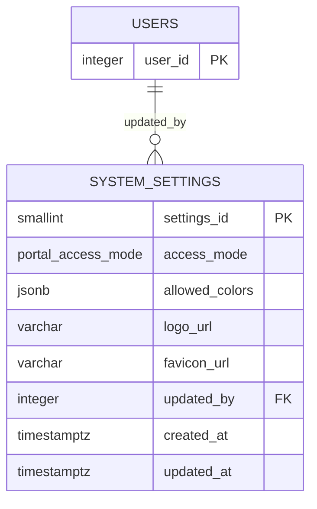

# Persistência da Configuração Global (`system_settings`)

## Issue relacionada

Issue #54 — BACKEND - Persistência de configuração global do portal

## Objetivo

Documentar a estrutura de banco de dados preparada para manter a configuração global
do portal de forma centralizada, sem depender de constantes do Frontend.

A persistência é entregue como uma tabela **singleton** (`system_settings`) com colunas
explícitas e defaults seguros, garantindo no nível do banco:

- exatamente **uma** configuração ativa/global;
- modo de abertura restrito a `PUBLIC` ou `AUTHENTICATED`;
- paleta de cores como `JSONB` (tamanho variável, evolui com o tema);
- rastreio de quem alterou e das datas de criação/atualização.

## Visão geral do modelo

A configuração global é composta por **uma única tabela**, com **uma única linha**
(`settings_id = 1`). Referencia `users` apenas para registrar o administrador que
alterou a configuração (`ON DELETE SET NULL`).

### Diagrama de relacionamento



Onde: `PK` = Primary Key; `FK` = Foreign Key.

## Tabela `system_settings`

Armazena a configuração global do portal. Possui exatamente uma linha, garantida pela
combinação de `PRIMARY KEY` + `CHECK (settings_id = 1)`.

### Estrutura

| Campo            | Tipo                      | Obrigatório | Restrição / Default                                      | Finalidade                         |
| ---------------- | ------------------------- | ----------- | -------------------------------------------------------- | ---------------------------------- |
| `settings_id`    | SMALLINT                  | Sim         | Primary Key; `DEFAULT 1`; CHECK `= 1`                    | Chave do singleton                 |
| `access_mode`    | ENUM `portal_access_mode` | Sim         | `PUBLIC` / `AUTHENTICATED`; `DEFAULT 'PUBLIC'`           | Modo de abertura do portal         |
| `allowed_colors` | JSONB                     | Sim         | CHECK `jsonb_typeof = 'array'`; default = paleta do tema | Cores permitidas (paleta)          |
| `logo_url`       | VARCHAR(500)              | Não         | NULL permitido                                           | Referência opcional ao logo        |
| `favicon_url`    | VARCHAR(500)              | Não         | NULL permitido                                           | Referência opcional ao favicon     |
| `updated_by`     | INTEGER                   | Não         | FK → `users.user_id`, `ON DELETE SET NULL`               | Usuário/admin que alterou          |
| `created_at`     | TIMESTAMPTZ               | Sim         | DEFAULT `CURRENT_TIMESTAMP`                              | Data e hora de criação do registro |
| `updated_at`     | TIMESTAMPTZ               | Não         | NULL até a primeira atualização                          | Data e hora da última atualização  |

### Restrições

- **Singleton:** `settings_id` é `PRIMARY KEY` e todo registro precisa atender
  `ck_system_settings_single_row (settings_id = 1)`. Juntas, as restrições permitem no
  máximo uma linha — qualquer segunda inserção falha (duplicação de PK ou violação do
  CHECK).
- **Modo de abertura:** `access_mode` usa o tipo nativo
  `portal_access_mode` (`PUBLIC` | `AUTHENTICATED`), com valor padrão `'PUBLIC'`
  (comportamento atual do portal: cadastro e acompanhamento públicos).
- **Paleta:** `allowed_colors` exige `jsonb_typeof = 'array'`
  (`ck_system_settings_allowed_colors_array`). O PostgreSQL não aceita subquery em
  CHECK, então a validação de que **todos os elementos são strings** (cores hex, ex.:
  `#0B3C5D`) fica a cargo da camada de aplicação (Zod), junto do futuro endpoint de
  atualização da configuração.
- **Ator:** `updated_by` referencia `users.user_id` com `ON DELETE SET NULL`; a
  troca/remoção de um usuário nunca invalida a configuração.
- **Tipo de enum nativo:** valores inválidos de `access_mode` (ex.: `ANONYMOUS`) são
  rejeitados pelo PostgreSQL no momento da inserção/atualização.

## Decisões de modelagem

### Por que uma tabela singleton em vez de constantes no código?

A configuração global precisa ser alterada sem deploy: cores do tema, modo de abertura e
referências a assets passam a ser dados administrados, consultáveis pelo Frontend via
API (endpoints fora do escopo desta issue, previstos para uma issue futura).

### Como o singleton é garantido?

`PRIMARY KEY (settings_id)` + `CHECK (settings_id = 1)`. A integridade é mantida pelo
banco, independente da camada de aplicação. Uma alternativa com `is_active` + índice
único parcial foi avaliada e descartada: permitiria linhas arquivadas, mas o histórico
de alterações já é coberto pelo `audit_history`.

### Onde o `JSONB` é usado e por quê?

- `allowed_colors` é `JSONB` (array): a paleta tem tamanho variável e evolui com o tema;
  como array JSONB, cores podem ser adicionadas/removidas sem migration. O CHECK garante
  o tipo externo (array); a validação de elementos (todas strings, formato hex) é da
  camada de aplicação e estará aliada ao tipo `SystemSettingsRow.allowed_colors:
string[]` do Backend.
- Demais campos são colunas explícitas e tipadas (`access_mode`, `logo_url`,
  `favicon_url`, `updated_by`, datas). Novos campos de configuração entram como novas
  colunas, versionadas por migration, evitando um "config bag" sem schema.

### Defaults e o tema atual (decisão registrada)

- `access_mode = 'PUBLIC'` reproduz o comportamento atual do portal.
- `allowed_colors` usa um **placeholder provisório**
  (`["#0B3C5D", "#1D2733", "#F5F5F5", "#FFFFFF"]`) enquanto as cores reais do tema não
  são confirmadas pelo Frontend/Produto (o Frontend não faz parte deste repositório).
  Quando o tema real for confirmado, o default deve ser atualizado em uma migration
  (`UPDATE system_settings SET allowed_colors = ...`).
- `logo_url` e `favicon_url` iniciam `NULL` (não há upload centralizado de assets hoje).

## Aplicando e revertendo

```bash
# aplica (cria a tabela, o enum e o registro padrão)
npm run migrate:latest

# reverte (remove a tabela e o tipo nativo)
npm run migrate:rollback
```

O registro padrão é inserido **na própria migration** — o singleton existe logo após o
`migrate:latest`, sem depender de `seed:run`.

> **Atenção no rollback:** o `down` também remove o tipo nativo `portal_access_mode`
> (`DROP TYPE IF EXISTS`). Isso é seguro enquanto o tipo for exclusivo desta tabela; se
> uma migration futura reutilizá-lo, o rollback desta migration precisará ser revisto.
