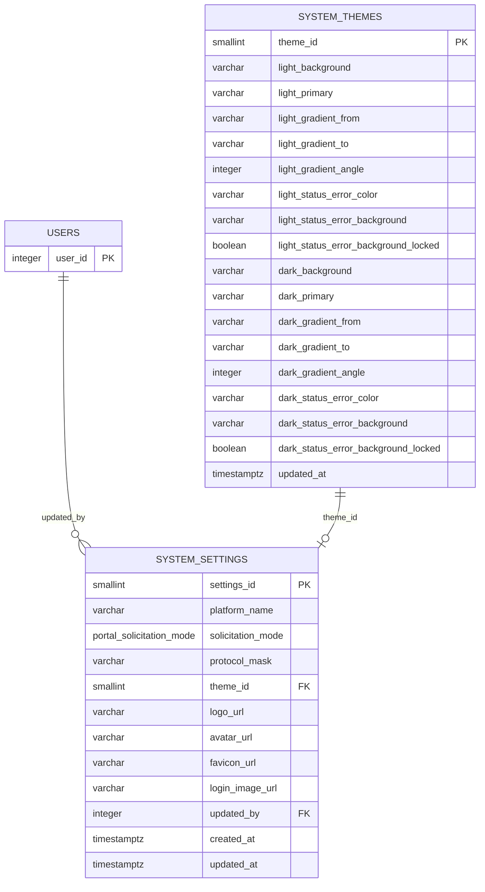

# Persistência da Configuração Global (`system_settings` + `system_themes`)

> ### ⚠️ Aviso de revisão (obrigatório na PR)
>
> Esta PR **REESCREVE a migration `20260915000000_create_system_settings.js`**
> que já está mergeada na `main` (PR #79). Ela foi remodelada para espelhar o
> contrato `portal-config-api.md` (tema em `system_themes` + identity/access/
> assets no `system_settings`). **O banco deve ser recriado do zero**
> (`DROP DATABASE` + `CREATE DATABASE` + `migrate:latest` + `seed:run`).
> **NÃO executar `migrate:latest` em ambientes que já tenham a #79 aplicada**
> — o Knex pula migration com batch registrado e o schema ficaria com as
> colunas antigas (`allowed_colors`/`access_mode`).

## Issues relacionadas

- Issue #54 — BACKEND - Persistência de configuração global do portal
- Issue #90 (contrato `portal-config-api.md`) — Configuração do portal (PortalConfig)

## Objetivo

Documentar a estrutura de banco de dados que persiste a configuração global do
portal — espelhando **exatamente** o contrato `portal-config-api.md` naquilo que
**não** vive em tabelas próprias.

O contrato é dividido em **duas tabelas**:

1. **`system_themes`** — TABELA PRÓPRIA do tema (`light`/`dark`), com **colunas
   explícitas** por token, gradiente e statuses — **sem JSONB** para as cores.
2. **`system_settings`** — o **resto** do singleton: identity (`platform_name`,
   `protocol_mask`), access (`solicitation_mode`) e assets (4 URLs), com FK para
   o tema vigente.

Ambas são singletons (`= 1`), garantidos por PK + CHECK.

## Visão geral do modelo

### O que NÃO fica no `system_settings`

Os dados que já vivem em tabelas próprias ficam nas suas tabelas, conforme o
contrato:

| Seção do contrato       | Tabela existente                               |
| ----------------------- | ---------------------------------------------- |
| `categories`            | `categories`                                   |
| `statuses`              | `statuses`                                     |
| `prioritizationWeights` | `criteria` (pesos por critério)                |
| `theme`                 | `system_themes` (tabela própria desta entrega) |

### Diagrama de relacionamento



Onde: `PK` = Primary Key; `FK` = Foreign Key.

## Tabela `system_settings`

Possui exatamente uma linha (singleton via `PRIMARY KEY` + `CHECK
(settings_id = 1)`). Mantém apenas o que não vive em tabela própria.

### Estrutura

| Campo               | Tipo                            | Obrigatório | Restrição / Default                        | Finalidade                              |
| ------------------- | ------------------------------- | ----------- | ------------------------------------------ | --------------------------------------- |
| `settings_id`       | SMALLINT                        | Sim         | PK; `DEFAULT 1`; CHECK `= 1`               | Chave do singleton                      |
| `platform_name`     | VARCHAR(80)                     | Sim         | Default `'MAAT'`                           | Nome exibido da plataforma              |
| `solicitation_mode` | ENUM `portal_solicitation_mode` | Sim         | `PUBLIC`/`AUTHENTICATED`; default `PUBLIC` | Modo de abertura do portal              |
| `protocol_mask`     | VARCHAR(10)                     | Sim         | Default `'MAAT'`                           | Máscara dos protocolos                  |
| `theme_id`          | SMALLINT                        | Não         | FK → `system_themes`, NULL permitido       | Tema vigente (tabela própria)           |
| `logo_url`          | VARCHAR(500)                    | Não         | NULL permitido                             | URL/caminho relativo do logo vigente    |
| `avatar_url`        | VARCHAR(500)                    | Não         | NULL permitido                             | URL/caminho relativo do avatar vigente  |
| `favicon_url`       | VARCHAR(500)                    | Não         | NULL permitido                             | URL/caminho relativo do favicon         |
| `login_image_url`   | VARCHAR(500)                    | Não         | NULL permitido                             | URL/caminho relativo da imagem de login |
| `updated_by`        | INTEGER                         | Não         | FK → `users.user_id`, `ON DELETE SET NULL` | Usuário/admin que alterou               |
| `created_at`        | TIMESTAMPTZ                     | Sim         | DEFAULT `CURRENT_TIMESTAMP`                | Criação do registro                     |
| `updated_at`        | TIMESTAMPTZ                     | Não         | NULL até a primeira atualização            | Última atualização                      |

## Tabela `system_themes`

Tabela **própria do tema**, colunas explícitas por paleta (sem JSONB), com
exatamente uma linha (singleton via `PRIMARY KEY` + `CHECK (theme_id = 1)`).

### Estrutura — theme (colunas explícitas)

Para cada paleta (`light_*` e `dark_*`) existem colunas explícitas:

- **Tokens de cor** — `VARCHAR(9)`, hex `#RRGGBB` ou `#RRGGBBAA` (NULL = tema
  indefinido):

  | Token           | Coluna                    |
  | --------------- | ------------------------- |
  | `background`    | `{paleta}_background`     |
  | `surface`       | `{paleta}_surface`        |
  | `border`        | `{paleta}_border`         |
  | `textPrimary`   | `{paleta}_text_primary`   |
  | `textSecondary` | `{paleta}_text_secondary` |
  | `richBlack`     | `{paleta}_rich_black`     |
  | `primary`       | `{paleta}_primary`        |
  | `secondary`     | `{paleta}_secondary`      |
  | `tint`          | `{paleta}_tint`           |
  | `onPrimary`     | `{paleta}_on_primary`     |
  | `onDark`        | `{paleta}_on_dark`        |
  | `onGradient`    | `{paleta}_on_gradient`    |

- **Gradiente** — `VARCHAR(9)` em `from`/`to` (hex) e `INTEGER` em `angle`
  (default `143`, 0–360);

- **Statuses** — para cada um dos 5 tons (`error`, `success`, `info`,
  `warning`, `neutral`): `{paleta}_status_{tom}_color` (hex),
  `{paleta}_status_{tom}_background` (hex) e
  `{paleta}_status_{tom}_background_locked` (boolean);

- **Auditoria** — `updated_at` apenas (o criador do tema é o `updated_by` do
  `system_settings` quando se grava o tema).

### Restrições

- **Singleton:** `theme_id` é `PRIMARY KEY` + `CHECK (theme_id = 1)`;
- **Cores hex:** `ck_system_themes_theme_hex` — toda coluna de cor aceita
  `NULL` **ou** regex `^#([0-9A-Fa-f]{6}|[0-9A-Fa-f]{8})$` (`#RRGGBB` ou
  `#RRGGBBAA`);
- **Ângulo do gradiente:** `ck_system_themes_gradient_angle` — `NULL` ou
  0..360.

> Nota: o `?` é placeholder de binding no `knex.raw`; o regex usa alternância
> `|` para evitá-lo e não corromper a constraint criada via migration.

## Relação entre as tabelas

`system_settings.theme_id` → `system_themes.theme_id` (`ON DELETE SET NULL`).
O tema é a única seção do contrato com tabela própria dentro desta entrega;
`GET /portal-config` consolida settings + theme + (categories/statuses/criteria)
na camada de aplicação.

## Decisões de modelagem

### Por que `theme` em tabela separada e `system_settings` enxuto?

O tema tem estrutura larga e explícita (~66 colunas) e é atualizado de forma
**atômica** (`PATCH /portal-config/theme` substitui light+dark completos).
Isolá-lo em `system_themes`:

- mantém `system_settings` enxuto (identity/access/assets);
- dá espaço para evolução (ex.: histórico de versões de tema) sem tocar no
  singleton de configuração;
- mantém a validação de hex/ângulo no banco por CHECK.

### Por que colunas explícitas em vez de JSONB?

O contrato define estrutura **fixa** de tema (tokens, gradiente, statuses), toda
hex validável. Colunas tipadas com CHECK de formato dão validação no banco,
refletem o schema no tipo `SystemThemeRow` e evitam o "config bag" do JSONB.

### Por que o tema pode iniciar vazio (cores NULL)?

O contrato permite "o backend iniciar sem tema e o frontend aplica os defaults
locais por token". O INSERT padrão cria o registro do tema (theme_id = 1) sem
cores; `system_settings.theme_id` aponta para ele já no nascimento.

### Onde ficam categories, statuses e pesos?

Nas tabelas próprias (`categories`, `statuses`, `criteria`).

## Aplicando e revertendo

```bash
# aplica (cria as duas tabelas, o enum e os registros padrão)
npm run migrate:latest

# reverte esta migration (remove as duas tabelas e o tipo nativo)
npx knex migrate:down --env development
```

Os registros padrão são inseridos **na própria migration** — os singletons
existem logo após o `migrate:latest`, sem depender de `seed:run`.

> **Atenção no rollback:** o `down` também remove o tipo nativo
> `portal_solicitation_mode` (`DROP TYPE IF EXISTS`). Seguro enquanto o tipo for
> exclusivo desta migration; se uma migration futura reutilizá-lo, o rollback
> precisará ser revisto.

## Exemplo de atualização (tema + parte visual)

```sql
-- tema (tabela própria)
UPDATE system_themes SET
  light_primary = '#00236F',
  dark_primary  = '#4C7DFF',
  light_gradient_from = '#002068',
  light_gradient_to   = '#003399',
  light_gradient_angle = 143,
  updated_at = now()
WHERE theme_id = 1;

-- resto do config (system_settings)
UPDATE system_settings SET
  favicon_url = '/assets/favicon.svg',
  updated_by = 102,
  updated_at = now()
WHERE settings_id = 1;
```
